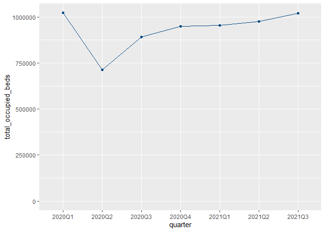
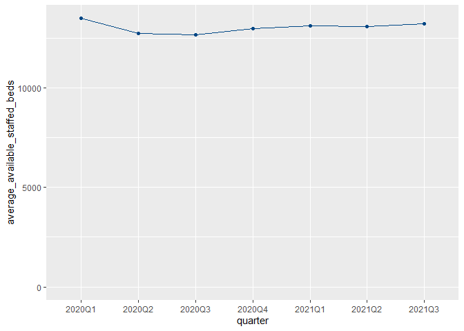
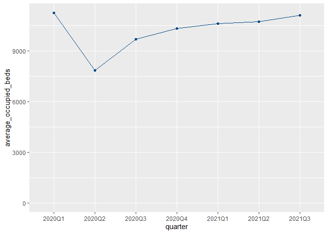
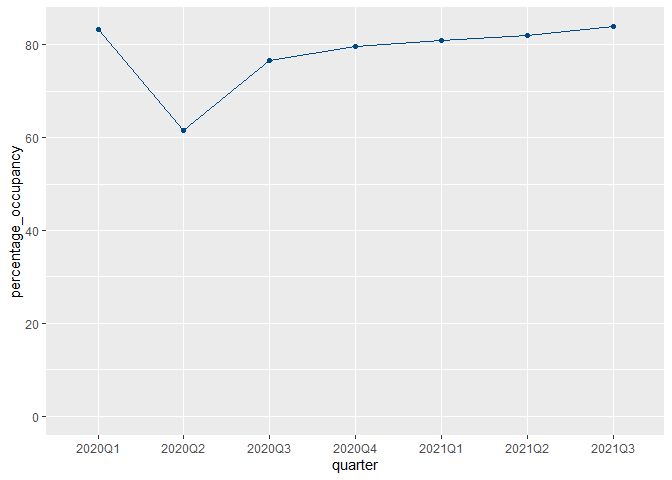

# Preamble

## Call libraries

```r
library(tidyverse)
```

```
## -- Attaching packages --------------------------------------- tidyverse 1.3.1 --
```

```
## v ggplot2 3.3.5     v purrr   0.3.4
## v tibble  3.1.6     v dplyr   1.0.8
## v tidyr   1.2.0     v stringr 1.4.0
## v readr   2.1.2     v forcats 0.5.1
```

```
## -- Conflicts ------------------------------------------ tidyverse_conflicts() --
## x dplyr::filter() masks stats::filter()
## x dplyr::lag()    masks stats::lag()
```

```r
library(janitor)
```

```
## 
## Attaching package: 'janitor'
```

```
## The following objects are masked from 'package:stats':
## 
##     chisq.test, fisher.test
```

```r
library(here)
```

```
## Warning: package 'here' was built under R version 4.1.3
```

```
## here() starts at C:/Users/John/Documents/CodeClan/group_project_john_hios/phs_db
```

```r
library(lubridate)
```

```
## 
## Attaching package: 'lubridate'
```

```
## The following objects are masked from 'package:base':
## 
##     date, intersect, setdiff, union
```

```r
library(ggthemes)
```

```
## Warning: package 'ggthemes' was built under R version 4.1.3
```


## Set up colour palette

```r
# The palette as per SF:
phs_palette <- c("#99DAF5", "#004785")

# # To use for fills, add
#   scale_fill_manual(values = phs_palette)
# 
# # To use for line and point colors, add
#   scale_colour_manual(values = phs_palette)
```


# Number of beds - Data Wrangling

## View bed data

```r
beds <- read_csv("data/beds_by_nhs_board_of_treatment_and_specialty.csv") 
```

```
## Rows: 30448 Columns: 20
## -- Column specification --------------------------------------------------------
## Delimiter: ","
## chr (11): Quarter, QuarterQF, HB, HBQF, Location, LocationQF, Specialty, Spe...
## dbl  (5): AllStaffedBeds, TotalOccupiedBeds, AverageAvailableStaffedBeds, Av...
## lgl  (4): AllStaffedBedsQF, TotalOccupiedBedsQF, AverageAvailableStaffedBeds...
## 
## i Use `spec()` to retrieve the full column specification for this data.
## i Specify the column types or set `show_col_types = FALSE` to quiet this message.
```

```r
glimpse(beds)
```

```
## Rows: 30,448
## Columns: 20
## $ Quarter                       <chr> "2016Q3", "2016Q3", "2016Q4", "2016Q4", ~
## $ QuarterQF                     <chr> NA, NA, NA, NA, NA, NA, NA, NA, NA, NA, ~
## $ HB                            <chr> "SB0801", "SB0801", "SB0801", "SB0801", ~
## $ HBQF                          <chr> NA, NA, NA, NA, NA, NA, NA, NA, NA, NA, ~
## $ Location                      <chr> "D102H", "SB0801", "D102H", "SB0801", "D~
## $ LocationQF                    <chr> NA, "d", NA, "d", NA, "d", NA, "d", NA, ~
## $ Specialty                     <chr> NA, NA, NA, NA, NA, NA, NA, NA, NA, NA, ~
## $ SpecialtyQF                   <chr> "z", "z", "z", "z", "z", "z", "z", "z", ~
## $ SpecialtyName                 <chr> "All Acute", "All Acute", "All Acute", "~
## $ SpecialtyNameQF               <chr> "d", "d", "d", "d", "d", "d", "d", "d", ~
## $ AllStaffedBeds                <dbl> 16413, 16413, 16117, 16117, 15622, 15622~
## $ AllStaffedBedsQF              <lgl> NA, NA, NA, NA, NA, NA, NA, NA, NA, NA, ~
## $ TotalOccupiedBeds             <dbl> 12380, 12380, 12049, 12049, 11569, 11569~
## $ TotalOccupiedBedsQF           <lgl> NA, NA, NA, NA, NA, NA, NA, NA, NA, NA, ~
## $ AverageAvailableStaffedBeds   <dbl> 178.4022, 178.4022, 175.1848, 175.1848, ~
## $ AverageAvailableStaffedBedsQF <lgl> NA, NA, NA, NA, NA, NA, NA, NA, NA, NA, ~
## $ AverageOccupiedBeds           <dbl> 134.5652, 134.5652, 130.9674, 130.9674, ~
## $ AverageOccupiedBedsQF         <lgl> NA, NA, NA, NA, NA, NA, NA, NA, NA, NA, ~
## $ PercentageOccupancy           <dbl> 75.42801, 75.42801, 74.75957, 74.75957, ~
## $ PercentageOccupancyQF         <chr> NA, NA, NA, NA, NA, NA, NA, NA, NA, NA, ~
```


### Check data  for NA values

```r
quarters_in_scope <- c("2020Q1", "2020Q2", "2020Q3", "2020Q4", "2021Q1", "2021Q2", "2021Q3")

beds %>%
  filter(Quarter %in% quarters_in_scope) %>%
  summarise(across(.cols = everything(),
                   .fns = ~sum(is.na(.x))))
```

<div data-pagedtable="false">
  <script data-pagedtable-source type="application/json">
{"columns":[{"label":["Quarter"],"name":[1],"type":["int"],"align":["right"]},{"label":["QuarterQF"],"name":[2],"type":["int"],"align":["right"]},{"label":["HB"],"name":[3],"type":["int"],"align":["right"]},{"label":["HBQF"],"name":[4],"type":["int"],"align":["right"]},{"label":["Location"],"name":[5],"type":["int"],"align":["right"]},{"label":["LocationQF"],"name":[6],"type":["int"],"align":["right"]},{"label":["Specialty"],"name":[7],"type":["int"],"align":["right"]},{"label":["SpecialtyQF"],"name":[8],"type":["int"],"align":["right"]},{"label":["SpecialtyName"],"name":[9],"type":["int"],"align":["right"]},{"label":["SpecialtyNameQF"],"name":[10],"type":["int"],"align":["right"]},{"label":["AllStaffedBeds"],"name":[11],"type":["int"],"align":["right"]},{"label":["AllStaffedBedsQF"],"name":[12],"type":["int"],"align":["right"]},{"label":["TotalOccupiedBeds"],"name":[13],"type":["int"],"align":["right"]},{"label":["TotalOccupiedBedsQF"],"name":[14],"type":["int"],"align":["right"]},{"label":["AverageAvailableStaffedBeds"],"name":[15],"type":["int"],"align":["right"]},{"label":["AverageAvailableStaffedBedsQF"],"name":[16],"type":["int"],"align":["right"]},{"label":["AverageOccupiedBeds"],"name":[17],"type":["int"],"align":["right"]},{"label":["AverageOccupiedBedsQF"],"name":[18],"type":["int"],"align":["right"]},{"label":["PercentageOccupancy"],"name":[19],"type":["int"],"align":["right"]},{"label":["PercentageOccupancyQF"],"name":[20],"type":["int"],"align":["right"]}],"data":[{"1":"0","2":"8553","3":"0","4":"9601","5":"0","6":"5857","7":"3272","8":"6749","9":"0","10":"7238","11":"0","12":"10021","13":"0","14":"10021","15":"0","16":"10021","17":"0","18":"10021","19":"4","20":"10017"}],"options":{"columns":{"min":{},"max":[10]},"rows":{"min":[10],"max":[10]},"pages":{}}}
  </script>
</div>

### Keep data related to our time frame of interest 

```r
quarters_in_scope <- c("2020Q1", "2020Q2", "2020Q3", "2020Q4", "2021Q1", "2021Q2", "2021Q3")

beds <- beds %>%
  filter(Quarter %in% quarters_in_scope)
```


```r
glimpse(beds)
```

```
## Rows: 10,021
## Columns: 20
## $ Quarter                       <chr> "2020Q1", "2020Q1", "2020Q2", "2020Q2", ~
## $ QuarterQF                     <chr> NA, NA, NA, NA, NA, NA, NA, NA, NA, NA, ~
## $ HB                            <chr> "SB0801", "SB0801", "SB0801", "SB0801", ~
## $ HBQF                          <chr> NA, NA, NA, NA, NA, NA, NA, NA, NA, NA, ~
## $ Location                      <chr> "D102H", "SB0801", "D102H", "SB0801", "D~
## $ LocationQF                    <chr> NA, "d", NA, "d", NA, "d", NA, "d", NA, ~
## $ Specialty                     <chr> NA, NA, NA, NA, NA, NA, NA, NA, NA, NA, ~
## $ SpecialtyQF                   <chr> "z", "z", "z", "z", "z", "z", "z", "z", ~
## $ SpecialtyName                 <chr> "All Acute", "All Acute", "All Acute", "~
## $ SpecialtyNameQF               <chr> "d", "d", "d", "d", "d", "d", "d", "d", ~
## $ AllStaffedBeds                <dbl> 14896, 14896, 14366, 14366, 15442, 15442~
## $ AllStaffedBedsQF              <lgl> NA, NA, NA, NA, NA, NA, NA, NA, NA, NA, ~
## $ TotalOccupiedBeds             <dbl> 10915, 10915, 8101, 8101, 9934, 9934, 11~
## $ TotalOccupiedBedsQF           <lgl> NA, NA, NA, NA, NA, NA, NA, NA, NA, NA, ~
## $ AverageAvailableStaffedBeds   <dbl> 163.6923, 163.6923, 157.8681, 157.8681, ~
## $ AverageAvailableStaffedBedsQF <lgl> NA, NA, NA, NA, NA, NA, NA, NA, NA, NA, ~
## $ AverageOccupiedBeds           <dbl> 119.94505, 119.94505, 89.02198, 89.02198~
## $ AverageOccupiedBedsQF         <lgl> NA, NA, NA, NA, NA, NA, NA, NA, NA, NA, ~
## $ PercentageOccupancy           <dbl> 73.27470, 73.27470, 56.39009, 56.39009, ~
## $ PercentageOccupancyQF         <chr> NA, NA, NA, NA, NA, NA, NA, NA, NA, NA, ~
```


### How many HB items do we have?

```r
beds %>%
  distinct(HB)
```

<div data-pagedtable="false">
  <script data-pagedtable-source type="application/json">
{"columns":[{"label":["HB"],"name":[1],"type":["chr"],"align":["left"]}],"data":[{"1":"SB0801"},{"1":"S08000015"},{"1":"S08000016"},{"1":"S08000017"},{"1":"S08000029"},{"1":"S08000019"},{"1":"S08000020"},{"1":"S08000031"},{"1":"S08000022"},{"1":"S08000032"},{"1":"S08000024"},{"1":"S08000025"},{"1":"S08000026"},{"1":"S08000030"},{"1":"S08000028"},{"1":"S92000003"}],"options":{"columns":{"min":{},"max":[10]},"rows":{"min":[10],"max":[10]},"pages":{}}}
  </script>
</div>


### Keep SpecialtyName == All Acute for the analysis

```r
beds <- beds %>%
  filter(SpecialtyName == "All Acute")
```


## View health board data

```r
health_board_labels <- read_csv("data/hb14_hb19.csv") 
```

```
## Rows: 18 Columns: 5
## -- Column specification --------------------------------------------------------
## Delimiter: ","
## chr (3): HB, HBName, Country
## dbl (2): HBDateEnacted, HBDateArchived
## 
## i Use `spec()` to retrieve the full column specification for this data.
## i Specify the column types or set `show_col_types = FALSE` to quiet this message.
```

```r
glimpse(health_board_labels)
```

```
## Rows: 18
## Columns: 5
## $ HB             <chr> "S08000015", "S08000016", "S08000017", "S08000018", "S0~
## $ HBName         <chr> "NHS Ayrshire and Arran", "NHS Borders", "NHS Dumfries ~
## $ HBDateEnacted  <dbl> 20140401, 20140401, 20140401, 20140401, 20140401, 20140~
## $ HBDateArchived <dbl> NA, NA, NA, 20180201, NA, NA, 20190331, NA, 20190331, N~
## $ Country        <chr> "S92000003", "S92000003", "S92000003", "S92000003", "S9~
```

### Remove junk

```r
health_board_labels <- health_board_labels %>% 
  select(HB, HBName)
  

glimpse(health_board_labels)
```

```
## Rows: 18
## Columns: 2
## $ HB     <chr> "S08000015", "S08000016", "S08000017", "S08000018", "S08000019"~
## $ HBName <chr> "NHS Ayrshire and Arran", "NHS Borders", "NHS Dumfries and Gall~
```


## View special health board data

**Note:** I had to use the following arguments to read the csv file, because the "The Golden Jubilee National Hospital" in the SHName column had a special Unicode character that I couldn't get rid off (if I kept the unicode character, I couldn't ``glimpse`` the data).

```r
shb_labels <- read_csv("data/special-health-boards_19022021.csv", locale = locale(encoding = "ASCII")) 
```

```
## Rows: 9 Columns: 3
## -- Column specification --------------------------------------------------------
## Delimiter: ","
## chr (3): SHB, SHBName, Country
## 
## i Use `spec()` to retrieve the full column specification for this data.
## i Specify the column types or set `show_col_types = FALSE` to quiet this message.
```

```r
glimpse(shb_labels)
```

```
## Rows: 9
## Columns: 3
## $ SHB     <chr> "SB0801", "SB0802", "SB0803", "SB0804", "SB0805", "SB0806", "S~
## $ SHBName <chr> "The Golden Jubilee National Hospital", "State Hospitals Board~
## $ Country <chr> "S92000003", "S92000003", "S92000003", "S92000003", "S92000003~
```
### Remove junk

```r
shb_labels <- shb_labels %>% 
  select(SHB, SHBName)
  

glimpse(shb_labels)
```

```
## Rows: 9
## Columns: 2
## $ SHB     <chr> "SB0801", "SB0802", "SB0803", "SB0804", "SB0805", "SB0806", "S~
## $ SHBName <chr> "The Golden Jubilee National Hospital", "State Hospitals Board~
```


### View country label data

```r
country_labels <- read_csv("data/geography_codes_and_labels_country.csv") 
```

```
## Rows: 1 Columns: 2
## -- Column specification --------------------------------------------------------
## Delimiter: ","
## chr (2): Country, CountryName
## 
## i Use `spec()` to retrieve the full column specification for this data.
## i Specify the column types or set `show_col_types = FALSE` to quiet this message.
```

```r
glimpse(country_labels)
```

```
## Rows: 1
## Columns: 2
## $ Country     <chr> "S92000003"
## $ CountryName <chr> "Scotland"
```


# Join tables 

## Join bed & special health board

```r
beds <- beds %>%
  left_join(shb_labels, by = c("HB" = "SHB"))

glimpse(beds)
```

```
## Rows: 361
## Columns: 21
## $ Quarter                       <chr> "2020Q1", "2020Q1", "2020Q2", "2020Q2", ~
## $ QuarterQF                     <chr> NA, NA, NA, NA, NA, NA, NA, NA, NA, NA, ~
## $ HB                            <chr> "SB0801", "SB0801", "SB0801", "SB0801", ~
## $ HBQF                          <chr> NA, NA, NA, NA, NA, NA, NA, NA, NA, NA, ~
## $ Location                      <chr> "D102H", "SB0801", "D102H", "SB0801", "D~
## $ LocationQF                    <chr> NA, "d", NA, "d", NA, "d", NA, "d", NA, ~
## $ Specialty                     <chr> NA, NA, NA, NA, NA, NA, NA, NA, NA, NA, ~
## $ SpecialtyQF                   <chr> "z", "z", "z", "z", "z", "z", "z", "z", ~
## $ SpecialtyName                 <chr> "All Acute", "All Acute", "All Acute", "~
## $ SpecialtyNameQF               <chr> "d", "d", "d", "d", "d", "d", "d", "d", ~
## $ AllStaffedBeds                <dbl> 14896, 14896, 14366, 14366, 15442, 15442~
## $ AllStaffedBedsQF              <lgl> NA, NA, NA, NA, NA, NA, NA, NA, NA, NA, ~
## $ TotalOccupiedBeds             <dbl> 10915, 10915, 8101, 8101, 9934, 9934, 11~
## $ TotalOccupiedBedsQF           <lgl> NA, NA, NA, NA, NA, NA, NA, NA, NA, NA, ~
## $ AverageAvailableStaffedBeds   <dbl> 163.6923, 163.6923, 157.8681, 157.8681, ~
## $ AverageAvailableStaffedBedsQF <lgl> NA, NA, NA, NA, NA, NA, NA, NA, NA, NA, ~
## $ AverageOccupiedBeds           <dbl> 119.94505, 119.94505, 89.02198, 89.02198~
## $ AverageOccupiedBedsQF         <lgl> NA, NA, NA, NA, NA, NA, NA, NA, NA, NA, ~
## $ PercentageOccupancy           <dbl> 73.27470, 73.27470, 56.39009, 56.39009, ~
## $ PercentageOccupancyQF         <chr> NA, NA, NA, NA, NA, NA, NA, NA, NA, NA, ~
## $ SHBName                       <chr> "The Golden Jubilee National Hospital", ~
```


```r
beds %>%
  summarise(across(.cols = everything(),
                   .fns = ~sum(is.na(.x))))
```

<div data-pagedtable="false">
  <script data-pagedtable-source type="application/json">
{"columns":[{"label":["Quarter"],"name":[1],"type":["int"],"align":["right"]},{"label":["QuarterQF"],"name":[2],"type":["int"],"align":["right"]},{"label":["HB"],"name":[3],"type":["int"],"align":["right"]},{"label":["HBQF"],"name":[4],"type":["int"],"align":["right"]},{"label":["Location"],"name":[5],"type":["int"],"align":["right"]},{"label":["LocationQF"],"name":[6],"type":["int"],"align":["right"]},{"label":["Specialty"],"name":[7],"type":["int"],"align":["right"]},{"label":["SpecialtyQF"],"name":[8],"type":["int"],"align":["right"]},{"label":["SpecialtyName"],"name":[9],"type":["int"],"align":["right"]},{"label":["SpecialtyNameQF"],"name":[10],"type":["int"],"align":["right"]},{"label":["AllStaffedBeds"],"name":[11],"type":["int"],"align":["right"]},{"label":["AllStaffedBedsQF"],"name":[12],"type":["int"],"align":["right"]},{"label":["TotalOccupiedBeds"],"name":[13],"type":["int"],"align":["right"]},{"label":["TotalOccupiedBedsQF"],"name":[14],"type":["int"],"align":["right"]},{"label":["AverageAvailableStaffedBeds"],"name":[15],"type":["int"],"align":["right"]},{"label":["AverageAvailableStaffedBedsQF"],"name":[16],"type":["int"],"align":["right"]},{"label":["AverageOccupiedBeds"],"name":[17],"type":["int"],"align":["right"]},{"label":["AverageOccupiedBedsQF"],"name":[18],"type":["int"],"align":["right"]},{"label":["PercentageOccupancy"],"name":[19],"type":["int"],"align":["right"]},{"label":["PercentageOccupancyQF"],"name":[20],"type":["int"],"align":["right"]},{"label":["SHBName"],"name":[21],"type":["int"],"align":["right"]}],"data":[{"1":"0","2":"310","3":"0","4":"354","5":"0","6":"249","7":"361","8":"0","9":"0","10":"0","11":"0","12":"361","13":"0","14":"361","15":"0","16":"361","17":"0","18":"361","19":"0","20":"361","21":"347"}],"options":{"columns":{"min":{},"max":[10]},"rows":{"min":[10],"max":[10]},"pages":{}}}
  </script>
</div>


## Joint bed & health board

```r
beds <- beds %>%
  left_join(health_board_labels, "HB")

glimpse(beds)
```

```
## Rows: 361
## Columns: 22
## $ Quarter                       <chr> "2020Q1", "2020Q1", "2020Q2", "2020Q2", ~
## $ QuarterQF                     <chr> NA, NA, NA, NA, NA, NA, NA, NA, NA, NA, ~
## $ HB                            <chr> "SB0801", "SB0801", "SB0801", "SB0801", ~
## $ HBQF                          <chr> NA, NA, NA, NA, NA, NA, NA, NA, NA, NA, ~
## $ Location                      <chr> "D102H", "SB0801", "D102H", "SB0801", "D~
## $ LocationQF                    <chr> NA, "d", NA, "d", NA, "d", NA, "d", NA, ~
## $ Specialty                     <chr> NA, NA, NA, NA, NA, NA, NA, NA, NA, NA, ~
## $ SpecialtyQF                   <chr> "z", "z", "z", "z", "z", "z", "z", "z", ~
## $ SpecialtyName                 <chr> "All Acute", "All Acute", "All Acute", "~
## $ SpecialtyNameQF               <chr> "d", "d", "d", "d", "d", "d", "d", "d", ~
## $ AllStaffedBeds                <dbl> 14896, 14896, 14366, 14366, 15442, 15442~
## $ AllStaffedBedsQF              <lgl> NA, NA, NA, NA, NA, NA, NA, NA, NA, NA, ~
## $ TotalOccupiedBeds             <dbl> 10915, 10915, 8101, 8101, 9934, 9934, 11~
## $ TotalOccupiedBedsQF           <lgl> NA, NA, NA, NA, NA, NA, NA, NA, NA, NA, ~
## $ AverageAvailableStaffedBeds   <dbl> 163.6923, 163.6923, 157.8681, 157.8681, ~
## $ AverageAvailableStaffedBedsQF <lgl> NA, NA, NA, NA, NA, NA, NA, NA, NA, NA, ~
## $ AverageOccupiedBeds           <dbl> 119.94505, 119.94505, 89.02198, 89.02198~
## $ AverageOccupiedBedsQF         <lgl> NA, NA, NA, NA, NA, NA, NA, NA, NA, NA, ~
## $ PercentageOccupancy           <dbl> 73.27470, 73.27470, 56.39009, 56.39009, ~
## $ PercentageOccupancyQF         <chr> NA, NA, NA, NA, NA, NA, NA, NA, NA, NA, ~
## $ SHBName                       <chr> "The Golden Jubilee National Hospital", ~
## $ HBName                        <chr> NA, NA, NA, NA, NA, NA, NA, NA, NA, NA, ~
```


```r
beds %>%
  summarise(across(.cols = everything(),
                   .fns = ~sum(is.na(.x))))
```

<div data-pagedtable="false">
  <script data-pagedtable-source type="application/json">
{"columns":[{"label":["Quarter"],"name":[1],"type":["int"],"align":["right"]},{"label":["QuarterQF"],"name":[2],"type":["int"],"align":["right"]},{"label":["HB"],"name":[3],"type":["int"],"align":["right"]},{"label":["HBQF"],"name":[4],"type":["int"],"align":["right"]},{"label":["Location"],"name":[5],"type":["int"],"align":["right"]},{"label":["LocationQF"],"name":[6],"type":["int"],"align":["right"]},{"label":["Specialty"],"name":[7],"type":["int"],"align":["right"]},{"label":["SpecialtyQF"],"name":[8],"type":["int"],"align":["right"]},{"label":["SpecialtyName"],"name":[9],"type":["int"],"align":["right"]},{"label":["SpecialtyNameQF"],"name":[10],"type":["int"],"align":["right"]},{"label":["AllStaffedBeds"],"name":[11],"type":["int"],"align":["right"]},{"label":["AllStaffedBedsQF"],"name":[12],"type":["int"],"align":["right"]},{"label":["TotalOccupiedBeds"],"name":[13],"type":["int"],"align":["right"]},{"label":["TotalOccupiedBedsQF"],"name":[14],"type":["int"],"align":["right"]},{"label":["AverageAvailableStaffedBeds"],"name":[15],"type":["int"],"align":["right"]},{"label":["AverageAvailableStaffedBedsQF"],"name":[16],"type":["int"],"align":["right"]},{"label":["AverageOccupiedBeds"],"name":[17],"type":["int"],"align":["right"]},{"label":["AverageOccupiedBedsQF"],"name":[18],"type":["int"],"align":["right"]},{"label":["PercentageOccupancy"],"name":[19],"type":["int"],"align":["right"]},{"label":["PercentageOccupancyQF"],"name":[20],"type":["int"],"align":["right"]},{"label":["SHBName"],"name":[21],"type":["int"],"align":["right"]},{"label":["HBName"],"name":[22],"type":["int"],"align":["right"]}],"data":[{"1":"0","2":"310","3":"0","4":"354","5":"0","6":"249","7":"361","8":"0","9":"0","10":"0","11":"0","12":"361","13":"0","14":"361","15":"0","16":"361","17":"0","18":"361","19":"0","20":"361","21":"347","22":"21"}],"options":{"columns":{"min":{},"max":[10]},"rows":{"min":[10],"max":[10]},"pages":{}}}
  </script>
</div>


```r
# beds <- beds %>% 
#   mutate(Country = if_else(!is.na(Country.x), Country.x, Country.y)) %>% 
#   select(-Country.x, -Country.y)
# 
# glimpse(beds) 
```


## Join bed & country labels

```r
beds <- beds %>%
  left_join(country_labels, by = c("HB" = "Country"))

glimpse(beds)
```

```
## Rows: 361
## Columns: 23
## $ Quarter                       <chr> "2020Q1", "2020Q1", "2020Q2", "2020Q2", ~
## $ QuarterQF                     <chr> NA, NA, NA, NA, NA, NA, NA, NA, NA, NA, ~
## $ HB                            <chr> "SB0801", "SB0801", "SB0801", "SB0801", ~
## $ HBQF                          <chr> NA, NA, NA, NA, NA, NA, NA, NA, NA, NA, ~
## $ Location                      <chr> "D102H", "SB0801", "D102H", "SB0801", "D~
## $ LocationQF                    <chr> NA, "d", NA, "d", NA, "d", NA, "d", NA, ~
## $ Specialty                     <chr> NA, NA, NA, NA, NA, NA, NA, NA, NA, NA, ~
## $ SpecialtyQF                   <chr> "z", "z", "z", "z", "z", "z", "z", "z", ~
## $ SpecialtyName                 <chr> "All Acute", "All Acute", "All Acute", "~
## $ SpecialtyNameQF               <chr> "d", "d", "d", "d", "d", "d", "d", "d", ~
## $ AllStaffedBeds                <dbl> 14896, 14896, 14366, 14366, 15442, 15442~
## $ AllStaffedBedsQF              <lgl> NA, NA, NA, NA, NA, NA, NA, NA, NA, NA, ~
## $ TotalOccupiedBeds             <dbl> 10915, 10915, 8101, 8101, 9934, 9934, 11~
## $ TotalOccupiedBedsQF           <lgl> NA, NA, NA, NA, NA, NA, NA, NA, NA, NA, ~
## $ AverageAvailableStaffedBeds   <dbl> 163.6923, 163.6923, 157.8681, 157.8681, ~
## $ AverageAvailableStaffedBedsQF <lgl> NA, NA, NA, NA, NA, NA, NA, NA, NA, NA, ~
## $ AverageOccupiedBeds           <dbl> 119.94505, 119.94505, 89.02198, 89.02198~
## $ AverageOccupiedBedsQF         <lgl> NA, NA, NA, NA, NA, NA, NA, NA, NA, NA, ~
## $ PercentageOccupancy           <dbl> 73.27470, 73.27470, 56.39009, 56.39009, ~
## $ PercentageOccupancyQF         <chr> NA, NA, NA, NA, NA, NA, NA, NA, NA, NA, ~
## $ SHBName                       <chr> "The Golden Jubilee National Hospital", ~
## $ HBName                        <chr> NA, NA, NA, NA, NA, NA, NA, NA, NA, NA, ~
## $ CountryName                   <chr> NA, NA, NA, NA, NA, NA, NA, NA, NA, NA, ~
```


```r
beds %>%
  # filter(Quarter %in% quarters_in_scope) %>%
  # filter(SpecialtyName == "All Acute") %>% 
  summarise(across(.cols = everything(),
                   .fns = ~sum(is.na(.x))))
```

<div data-pagedtable="false">
  <script data-pagedtable-source type="application/json">
{"columns":[{"label":["Quarter"],"name":[1],"type":["int"],"align":["right"]},{"label":["QuarterQF"],"name":[2],"type":["int"],"align":["right"]},{"label":["HB"],"name":[3],"type":["int"],"align":["right"]},{"label":["HBQF"],"name":[4],"type":["int"],"align":["right"]},{"label":["Location"],"name":[5],"type":["int"],"align":["right"]},{"label":["LocationQF"],"name":[6],"type":["int"],"align":["right"]},{"label":["Specialty"],"name":[7],"type":["int"],"align":["right"]},{"label":["SpecialtyQF"],"name":[8],"type":["int"],"align":["right"]},{"label":["SpecialtyName"],"name":[9],"type":["int"],"align":["right"]},{"label":["SpecialtyNameQF"],"name":[10],"type":["int"],"align":["right"]},{"label":["AllStaffedBeds"],"name":[11],"type":["int"],"align":["right"]},{"label":["AllStaffedBedsQF"],"name":[12],"type":["int"],"align":["right"]},{"label":["TotalOccupiedBeds"],"name":[13],"type":["int"],"align":["right"]},{"label":["TotalOccupiedBedsQF"],"name":[14],"type":["int"],"align":["right"]},{"label":["AverageAvailableStaffedBeds"],"name":[15],"type":["int"],"align":["right"]},{"label":["AverageAvailableStaffedBedsQF"],"name":[16],"type":["int"],"align":["right"]},{"label":["AverageOccupiedBeds"],"name":[17],"type":["int"],"align":["right"]},{"label":["AverageOccupiedBedsQF"],"name":[18],"type":["int"],"align":["right"]},{"label":["PercentageOccupancy"],"name":[19],"type":["int"],"align":["right"]},{"label":["PercentageOccupancyQF"],"name":[20],"type":["int"],"align":["right"]},{"label":["SHBName"],"name":[21],"type":["int"],"align":["right"]},{"label":["HBName"],"name":[22],"type":["int"],"align":["right"]},{"label":["CountryName"],"name":[23],"type":["int"],"align":["right"]}],"data":[{"1":"0","2":"310","3":"0","4":"354","5":"0","6":"249","7":"361","8":"0","9":"0","10":"0","11":"0","12":"361","13":"0","14":"361","15":"0","16":"361","17":"0","18":"361","19":"0","20":"361","21":"347","22":"21","23":"354"}],"options":{"columns":{"min":{},"max":[10]},"rows":{"min":[10],"max":[10]},"pages":{}}}
  </script>
</div>

##  Tidy up finalised bed table

```r
beds <- beds %>%
  clean_names()

glimpse(beds)
```

```
## Rows: 361
## Columns: 23
## $ quarter                           <chr> "2020Q1", "2020Q1", "2020Q2", "2020Q~
## $ quarter_qf                        <chr> NA, NA, NA, NA, NA, NA, NA, NA, NA, ~
## $ hb                                <chr> "SB0801", "SB0801", "SB0801", "SB080~
## $ hbqf                              <chr> NA, NA, NA, NA, NA, NA, NA, NA, NA, ~
## $ location                          <chr> "D102H", "SB0801", "D102H", "SB0801"~
## $ location_qf                       <chr> NA, "d", NA, "d", NA, "d", NA, "d", ~
## $ specialty                         <chr> NA, NA, NA, NA, NA, NA, NA, NA, NA, ~
## $ specialty_qf                      <chr> "z", "z", "z", "z", "z", "z", "z", "~
## $ specialty_name                    <chr> "All Acute", "All Acute", "All Acute~
## $ specialty_name_qf                 <chr> "d", "d", "d", "d", "d", "d", "d", "~
## $ all_staffed_beds                  <dbl> 14896, 14896, 14366, 14366, 15442, 1~
## $ all_staffed_beds_qf               <lgl> NA, NA, NA, NA, NA, NA, NA, NA, NA, ~
## $ total_occupied_beds               <dbl> 10915, 10915, 8101, 8101, 9934, 9934~
## $ total_occupied_beds_qf            <lgl> NA, NA, NA, NA, NA, NA, NA, NA, NA, ~
## $ average_available_staffed_beds    <dbl> 163.6923, 163.6923, 157.8681, 157.86~
## $ average_available_staffed_beds_qf <lgl> NA, NA, NA, NA, NA, NA, NA, NA, NA, ~
## $ average_occupied_beds             <dbl> 119.94505, 119.94505, 89.02198, 89.0~
## $ average_occupied_beds_qf          <lgl> NA, NA, NA, NA, NA, NA, NA, NA, NA, ~
## $ percentage_occupancy              <dbl> 73.27470, 73.27470, 56.39009, 56.390~
## $ percentage_occupancy_qf           <chr> NA, NA, NA, NA, NA, NA, NA, NA, NA, ~
## $ shb_name                          <chr> "The Golden Jubilee National Hospita~
## $ hb_name                           <chr> NA, NA, NA, NA, NA, NA, NA, NA, NA, ~
## $ country_name                      <chr> NA, NA, NA, NA, NA, NA, NA, NA, NA, ~
```


**Sanity Check - There should be on average 13,226 available staffed beds in Scotland during quarter ending September 2021 (PHS report)**

```r
beds %>%
  filter(country_name == "Scotland")
```

<div data-pagedtable="false">
  <script data-pagedtable-source type="application/json">
{"columns":[{"label":["quarter"],"name":[1],"type":["chr"],"align":["left"]},{"label":["quarter_qf"],"name":[2],"type":["chr"],"align":["left"]},{"label":["hb"],"name":[3],"type":["chr"],"align":["left"]},{"label":["hbqf"],"name":[4],"type":["chr"],"align":["left"]},{"label":["location"],"name":[5],"type":["chr"],"align":["left"]},{"label":["location_qf"],"name":[6],"type":["chr"],"align":["left"]},{"label":["specialty"],"name":[7],"type":["chr"],"align":["left"]},{"label":["specialty_qf"],"name":[8],"type":["chr"],"align":["left"]},{"label":["specialty_name"],"name":[9],"type":["chr"],"align":["left"]},{"label":["specialty_name_qf"],"name":[10],"type":["chr"],"align":["left"]},{"label":["all_staffed_beds"],"name":[11],"type":["dbl"],"align":["right"]},{"label":["all_staffed_beds_qf"],"name":[12],"type":["lgl"],"align":["right"]},{"label":["total_occupied_beds"],"name":[13],"type":["dbl"],"align":["right"]},{"label":["total_occupied_beds_qf"],"name":[14],"type":["lgl"],"align":["right"]},{"label":["average_available_staffed_beds"],"name":[15],"type":["dbl"],"align":["right"]},{"label":["average_available_staffed_beds_qf"],"name":[16],"type":["lgl"],"align":["right"]},{"label":["average_occupied_beds"],"name":[17],"type":["dbl"],"align":["right"]},{"label":["average_occupied_beds_qf"],"name":[18],"type":["lgl"],"align":["right"]},{"label":["percentage_occupancy"],"name":[19],"type":["dbl"],"align":["right"]},{"label":["percentage_occupancy_qf"],"name":[20],"type":["chr"],"align":["left"]},{"label":["shb_name"],"name":[21],"type":["chr"],"align":["left"]},{"label":["hb_name"],"name":[22],"type":["chr"],"align":["left"]},{"label":["country_name"],"name":[23],"type":["chr"],"align":["left"]}],"data":[{"1":"2020Q1","2":"NA","3":"S92000003","4":"d","5":"S92000003","6":"d","7":"NA","8":"z","9":"All Acute","10":"d","11":"1226533","12":"NA","13":"1022753","14":"NA","15":"13478.38","16":"NA","17":"11239.044","18":"NA","19":"83.38569","20":"NA","21":"NA","22":"NA","23":"Scotland"},{"1":"2020Q2","2":"NA","3":"S92000003","4":"d","5":"S92000003","6":"d","7":"NA","8":"z","9":"All Acute","10":"d","11":"1157700","12":"NA","13":"712506","14":"NA","15":"12721.98","16":"NA","17":"7829.736","18":"NA","19":"61.54496","20":"NA","21":"NA","22":"NA","23":"Scotland"},{"1":"2020Q3","2":"NA","3":"S92000003","4":"d","5":"S92000003","6":"d","7":"NA","8":"z","9":"All Acute","10":"d","11":"1164931","12":"NA","13":"892345","14":"NA","15":"12662.29","16":"NA","17":"9699.402","18":"NA","19":"76.60067","20":"NA","21":"NA","22":"NA","23":"Scotland"},{"1":"2020Q4","2":"NA","3":"S92000003","4":"d","5":"S92000003","6":"d","7":"NA","8":"z","9":"All Acute","10":"d","11":"1193954","12":"NA","13":"949828","14":"NA","15":"12977.76","16":"NA","17":"10324.217","18":"NA","19":"79.55315","20":"NA","21":"NA","22":"NA","23":"Scotland"},{"1":"2021Q1","2":"NA","3":"S92000003","4":"d","5":"S92000003","6":"d","7":"NA","8":"z","9":"All Acute","10":"d","11":"1180684","12":"NA","13":"954767","14":"NA","15":"13118.71","16":"NA","17":"10608.522","18":"NA","19":"80.86558","20":"NA","21":"NA","22":"NA","23":"Scotland"},{"1":"2021Q2","2":"NA","3":"S92000003","4":"d","5":"S92000003","6":"d","7":"NA","8":"z","9":"All Acute","10":"d","11":"1189154","12":"NA","13":"975297","14":"NA","15":"13067.63","16":"NA","17":"10717.549","18":"NA","19":"82.01604","20":"NA","21":"NA","22":"NA","23":"Scotland"},{"1":"2021Q3","2":"p","3":"S92000003","4":"d","5":"S92000003","6":"d","7":"NA","8":"z","9":"All Acute","10":"d","11":"1216760","12":"NA","13":"1020933","14":"NA","15":"13225.65","16":"NA","17":"11097.098","18":"NA","19":"83.90586","20":"NA","21":"NA","22":"NA","23":"Scotland"}],"options":{"columns":{"min":{},"max":[10]},"rows":{"min":[10],"max":[10]},"pages":{}}}
  </script>
</div>


# KPI plots (Scotland: 2020Q1 - 2021Q3)


## Selected Geography: Scotland

```r
beds %>%
  filter(country_name == "Scotland") %>% 
  ggplot() +
  aes(x = quarter, y = total_occupied_beds, group = country_name, colour = country_name) +
  geom_line() +
  geom_point() +
  scale_colour_manual(guide = "none", values = phs_palette[2]) +
  ylim(c(0, NA))
```

<!-- -->

```r
beds %>%
  filter(country_name == "Scotland") %>%
  ggplot() +
  aes(x = quarter, y = average_available_staffed_beds, group = country_name, colour = country_name) +
  geom_line() +
  geom_point() +
  scale_colour_manual(guide = "none", values = phs_palette[2]) +
  ylim(c(0, NA))
```

<!-- -->

```r
beds %>%
  filter(country_name == "Scotland") %>%
  ggplot() +
  aes(x = quarter, y = average_occupied_beds, group = country_name, colour = country_name) +
  geom_line() +
  geom_point() +
  scale_colour_manual(guide = "none", values = phs_palette[2]) +
  ylim(c(0, NA))
```

<!-- -->

```r
beds %>%
  filter(country_name == "Scotland") %>%
  ggplot() +
  aes(x = quarter, y = percentage_occupancy, group = country_name, colour = country_name) +
  geom_line() +
  geom_point() +
  scale_colour_manual(guide = "none", values = phs_palette[2]) +
  ylim(c(0, NA))
```

<!-- -->

### Sanity check No. 1. 

Check if I pick in the location column the aggregated results of value S08000031 

```r
beds %>%
  # filter(hb_name == "NHS Greater Glasgow and Clyde") %>% 
  filter(hb_name == "NHS Grampian") %>% 
  filter(location == hb) %>% 
  summarise(avg_tot_occ_beds = mean(total_occupied_beds),
            avg_avail_staffed_beds = mean(average_available_staffed_beds),
            avg_occupied_beds = mean(average_occupied_beds),
            avg_percentage_occupancy = mean(percentage_occupancy))
```

<div data-pagedtable="false">
  <script data-pagedtable-source type="application/json">
{"columns":[{"label":["avg_tot_occ_beds"],"name":[1],"type":["dbl"],"align":["right"]},{"label":["avg_avail_staffed_beds"],"name":[2],"type":["dbl"],"align":["right"]},{"label":["avg_occupied_beds"],"name":[3],"type":["dbl"],"align":["right"]},{"label":["avg_percentage_occupancy"],"name":[4],"type":["dbl"],"align":["right"]}],"data":[{"1":"70122.29","2":"957.9192","3":"768.2776","4":"80.15914"}],"options":{"columns":{"min":{},"max":[10]},"rows":{"min":[10],"max":[10]},"pages":{}}}
  </script>
</div>


```r
beds %>%
  # filter(hb_name == "NHS Greater Glasgow and Clyde" ) %>% 
  filter(hb_name == "NHS Grampian" ) %>% 
  group_by(location) %>% 
  summarise(avg_tot_occ_beds = mean(total_occupied_beds),
            avg_avail_staffed_beds = mean(average_available_staffed_beds),
            avg_occupied_beds = mean(average_occupied_beds),
            avg_percentage_occupancy = mean(percentage_occupancy)) 
```

<div data-pagedtable="false">
  <script data-pagedtable-source type="application/json">
{"columns":[{"label":["location"],"name":[1],"type":["chr"],"align":["left"]},{"label":["avg_tot_occ_beds"],"name":[2],"type":["dbl"],"align":["right"]},{"label":["avg_avail_staffed_beds"],"name":[3],"type":["dbl"],"align":["right"]},{"label":["avg_occupied_beds"],"name":[4],"type":["dbl"],"align":["right"]},{"label":["avg_percentage_occupancy"],"name":[5],"type":["dbl"],"align":["right"]}],"data":[{"1":"N101H","2":"48766.857","3":"652.2079551","4":"534.3337285","5":"81.76365"},{"1":"N411H","2":"7027.429","3":"98.5499276","4":"76.9952013","5":"78.67589"},{"1":"S08000020","2":"70122.286","3":"957.9191796","4":"768.2776341","5":"80.15914"},{"1":"T312H","2":"58.000","3":"0.6373626","4":"0.6373626","5":"100.00000"}],"options":{"columns":{"min":{},"max":[10]},"rows":{"min":[10],"max":[10]},"pages":{}}}
  </script>
</div>

## Selected Geography: NHS Board

```r
beds %>%
  filter(hb_name == "NHS Greater Glasgow and Clyde") %>%
  filter(location == hb) %>% 
  ggplot() +
  aes(x = quarter, y = total_occupied_beds, group = country_name, colour = hb_name) +
  geom_line() +
  geom_point() +
  scale_colour_manual(guide = "none", values = phs_palette[2]) +
  ylim(c(0, NA))
```

<!-- -->

```r
beds %>%
  filter(hb_name == "NHS Greater Glasgow and Clyde") %>%
  filter(location == hb) %>%  
  ggplot() +
  aes(x = quarter, y = average_available_staffed_beds, group = country_name, colour = hb_name) +
  geom_line() +
  geom_point() +
  scale_colour_manual(guide = "none", values = phs_palette[2]) +
  ylim(c(0, NA))
```

<!-- -->

```r
beds %>%
  filter(hb_name == "NHS Greater Glasgow and Clyde") %>%
  filter(location == hb) %>% 
  ggplot() +
  aes(x = quarter, y = average_occupied_beds, group = country_name, colour = hb_name) +
  geom_line() +
  geom_point() +
  scale_colour_manual(guide = "none", values = phs_palette[2]) +
  ylim(c(0, NA))
```

<!-- -->

```r
beds %>%
  filter(hb_name == "NHS Greater Glasgow and Clyde") %>%
  filter(location == hb) %>%  
  ggplot() +
  aes(x = quarter, y = percentage_occupancy, group = country_name, colour = hb_name) +
  geom_line() +
  geom_point() +
  scale_colour_manual(guide = "none", values = phs_palette[2]) +
  ylim(c(0, NA))
```

<!-- -->


### Sanity check No. 2.
Check to see if I pick in the location column the aggregated results of value SB0801 

```r
beds %>%
  # filter(hb_name == "NHS Greater Glasgow and Clyde" ) %>% 
  filter(shb_name == "The Golden Jubilee National Hospital" ) %>% 
  group_by(location) %>% 
  summarise(avg_tot_occ_beds = mean(total_occupied_beds),
            avg_avail_staffed_beds = mean(average_available_staffed_beds),
            avg_occupied_beds = mean(average_occupied_beds),
            avg_percentage_occupancy = mean(percentage_occupancy)) 
```

<div data-pagedtable="false">
  <script data-pagedtable-source type="application/json">
{"columns":[{"label":["location"],"name":[1],"type":["chr"],"align":["left"]},{"label":["avg_tot_occ_beds"],"name":[2],"type":["dbl"],"align":["right"]},{"label":["avg_avail_staffed_beds"],"name":[3],"type":["dbl"],"align":["right"]},{"label":["avg_occupied_beds"],"name":[4],"type":["dbl"],"align":["right"]},{"label":["avg_percentage_occupancy"],"name":[5],"type":["dbl"],"align":["right"]}],"data":[{"1":"D102H","2":"10924.57","3":"172.11","4":"119.6953","5":"69.32331"},{"1":"SB0801","2":"10924.57","3":"172.11","4":"119.6953","5":"69.32331"}],"options":{"columns":{"min":{},"max":[10]},"rows":{"min":[10],"max":[10]},"pages":{}}}
  </script>
</div>


```r
beds %>%
  filter(shb_name == "The Golden Jubilee National Hospital") %>%
  filter(location == hb) %>% 
  summarise(avg_tot_occ_beds = mean(total_occupied_beds),
            avg_avail_staffed_beds = mean(average_available_staffed_beds),
            avg_occupied_beds = mean(average_occupied_beds),
            avg_percentage_occupancy = mean(percentage_occupancy))
```

<div data-pagedtable="false">
  <script data-pagedtable-source type="application/json">
{"columns":[{"label":["avg_tot_occ_beds"],"name":[1],"type":["dbl"],"align":["right"]},{"label":["avg_avail_staffed_beds"],"name":[2],"type":["dbl"],"align":["right"]},{"label":["avg_occupied_beds"],"name":[3],"type":["dbl"],"align":["right"]},{"label":["avg_percentage_occupancy"],"name":[4],"type":["dbl"],"align":["right"]}],"data":[{"1":"10924.57","2":"172.11","3":"119.6953","4":"69.32331"}],"options":{"columns":{"min":{},"max":[10]},"rows":{"min":[10],"max":[10]},"pages":{}}}
  </script>
</div>


## Selected Geography: Special Health Board

```r
beds %>%
  filter(shb_name == "The Golden Jubilee National Hospital") %>%
  filter(location == hb) %>% 
  ggplot() +
  aes(x = quarter, y = total_occupied_beds, group = country_name, colour = shb_name) +
  geom_line() +
  geom_point() +
  scale_colour_manual(guide = "none", values = phs_palette[2]) +
  ylim(c(0, NA))
```

<!-- -->

```r
beds %>%
  filter(shb_name == "The Golden Jubilee National Hospital") %>%
  filter(location == hb) %>%  
  ggplot() +
  aes(x = quarter, y = average_available_staffed_beds, group = country_name, colour = shb_name) +
  geom_line() +
  geom_point() +
  scale_colour_manual(guide = "none", values = phs_palette[2]) +
  ylim(c(0, NA))
```

<!-- -->

```r
beds %>%
  filter(shb_name == "The Golden Jubilee National Hospital") %>%
  filter(location == hb) %>% 
  ggplot() +
  aes(x = quarter, y = average_occupied_beds, group = country_name, colour = shb_name) +
  geom_line() +
  geom_point() +
  scale_colour_manual(guide = "none", values = phs_palette[2]) +
  ylim(c(0, NA))
```

<!-- -->

```r
beds %>%
  filter(shb_name == "The Golden Jubilee National Hospital") %>%
  filter(location == hb) %>%  
  ggplot() +
  aes(x = quarter, y = percentage_occupancy, group = country_name, colour = shb_name) +
  geom_line() +
  geom_point() +
  scale_colour_manual(guide = "none", values = phs_palette[2]) +
  ylim(c(0, NA))
```

<!-- -->


