# Intro

This markdown describes the data cleaning/wrangling steps to process and visualise the bed data from 2020 onwards. The mean value of the bed data from 2016 to 2019 is also calculated in order to provide a reference value for comparisons.


# Preamble

## Call libraries

```r
library(tidyverse)
```

```
## -- Attaching packages --------------------------------------- tidyverse 1.3.1 --
```

```
## v ggplot2 3.3.5     v purrr   0.3.4
## v tibble  3.1.6     v dplyr   1.0.8
## v tidyr   1.2.0     v stringr 1.4.0
## v readr   2.1.2     v forcats 0.5.1
```

```
## -- Conflicts ------------------------------------------ tidyverse_conflicts() --
## x dplyr::filter() masks stats::filter()
## x dplyr::lag()    masks stats::lag()
```

```r
library(janitor)
```

```
## 
## Attaching package: 'janitor'
```

```
## The following objects are masked from 'package:stats':
## 
##     chisq.test, fisher.test
```

```r
library(here)
```

```
## Warning: package 'here' was built under R version 4.1.3
```

```
## here() starts at C:/Users/John/Documents/CodeClan/CC_PDA2_G1/group_project_john_hios/phs_db
```

```r
library(lubridate)
```

```
## 
## Attaching package: 'lubridate'
```

```
## The following objects are masked from 'package:base':
## 
##     date, intersect, setdiff, union
```

```r
library(ggthemes)
```

```
## Warning: package 'ggthemes' was built under R version 4.1.3
```


## Set up colour palette

```r
# The palette as per SF:
phs_palette <- c("#99DAF5", "#004785", "#C027B9", "#82BB25")

# # To use for fills, add
#   scale_fill_manual(values = phs_palette)
# 
# # To use for line and point colors, add
#   scale_colour_manual(values = phs_palette)
```


# Number of beds - Data Wrangling

## View bed data

```r
beds <- read_csv("data/beds_by_nhs_board_of_treatment_and_specialty.csv") 
```

```
## Rows: 30448 Columns: 20
## -- Column specification --------------------------------------------------------
## Delimiter: ","
## chr (11): Quarter, QuarterQF, HB, HBQF, Location, LocationQF, Specialty, Spe...
## dbl  (5): AllStaffedBeds, TotalOccupiedBeds, AverageAvailableStaffedBeds, Av...
## lgl  (4): AllStaffedBedsQF, TotalOccupiedBedsQF, AverageAvailableStaffedBeds...
## 
## i Use `spec()` to retrieve the full column specification for this data.
## i Specify the column types or set `show_col_types = FALSE` to quiet this message.
```

```r
glimpse(beds)
```

```
## Rows: 30,448
## Columns: 20
## $ Quarter                       <chr> "2016Q3", "2016Q3", "2016Q4", "2016Q4", ~
## $ QuarterQF                     <chr> NA, NA, NA, NA, NA, NA, NA, NA, NA, NA, ~
## $ HB                            <chr> "SB0801", "SB0801", "SB0801", "SB0801", ~
## $ HBQF                          <chr> NA, NA, NA, NA, NA, NA, NA, NA, NA, NA, ~
## $ Location                      <chr> "D102H", "SB0801", "D102H", "SB0801", "D~
## $ LocationQF                    <chr> NA, "d", NA, "d", NA, "d", NA, "d", NA, ~
## $ Specialty                     <chr> NA, NA, NA, NA, NA, NA, NA, NA, NA, NA, ~
## $ SpecialtyQF                   <chr> "z", "z", "z", "z", "z", "z", "z", "z", ~
## $ SpecialtyName                 <chr> "All Acute", "All Acute", "All Acute", "~
## $ SpecialtyNameQF               <chr> "d", "d", "d", "d", "d", "d", "d", "d", ~
## $ AllStaffedBeds                <dbl> 16413, 16413, 16117, 16117, 15622, 15622~
## $ AllStaffedBedsQF              <lgl> NA, NA, NA, NA, NA, NA, NA, NA, NA, NA, ~
## $ TotalOccupiedBeds             <dbl> 12380, 12380, 12049, 12049, 11569, 11569~
## $ TotalOccupiedBedsQF           <lgl> NA, NA, NA, NA, NA, NA, NA, NA, NA, NA, ~
## $ AverageAvailableStaffedBeds   <dbl> 178.4022, 178.4022, 175.1848, 175.1848, ~
## $ AverageAvailableStaffedBedsQF <lgl> NA, NA, NA, NA, NA, NA, NA, NA, NA, NA, ~
## $ AverageOccupiedBeds           <dbl> 134.5652, 134.5652, 130.9674, 130.9674, ~
## $ AverageOccupiedBedsQF         <lgl> NA, NA, NA, NA, NA, NA, NA, NA, NA, NA, ~
## $ PercentageOccupancy           <dbl> 75.42801, 75.42801, 74.75957, 74.75957, ~
## $ PercentageOccupancyQF         <chr> NA, NA, NA, NA, NA, NA, NA, NA, NA, NA, ~
```


### Check data  for NA values

```r
quarters_in_scope <- c("2020Q1", "2020Q2", "2020Q3", "2020Q4", "2021Q1", "2021Q2", "2021Q3")

beds %>%
  filter(Quarter %in% quarters_in_scope) %>%
  summarise(across(.cols = everything(),
                   .fns = ~sum(is.na(.x))))
```

<div data-pagedtable="false">
  <script data-pagedtable-source type="application/json">
{"columns":[{"label":["Quarter"],"name":[1],"type":["int"],"align":["right"]},{"label":["QuarterQF"],"name":[2],"type":["int"],"align":["right"]},{"label":["HB"],"name":[3],"type":["int"],"align":["right"]},{"label":["HBQF"],"name":[4],"type":["int"],"align":["right"]},{"label":["Location"],"name":[5],"type":["int"],"align":["right"]},{"label":["LocationQF"],"name":[6],"type":["int"],"align":["right"]},{"label":["Specialty"],"name":[7],"type":["int"],"align":["right"]},{"label":["SpecialtyQF"],"name":[8],"type":["int"],"align":["right"]},{"label":["SpecialtyName"],"name":[9],"type":["int"],"align":["right"]},{"label":["SpecialtyNameQF"],"name":[10],"type":["int"],"align":["right"]},{"label":["AllStaffedBeds"],"name":[11],"type":["int"],"align":["right"]},{"label":["AllStaffedBedsQF"],"name":[12],"type":["int"],"align":["right"]},{"label":["TotalOccupiedBeds"],"name":[13],"type":["int"],"align":["right"]},{"label":["TotalOccupiedBedsQF"],"name":[14],"type":["int"],"align":["right"]},{"label":["AverageAvailableStaffedBeds"],"name":[15],"type":["int"],"align":["right"]},{"label":["AverageAvailableStaffedBedsQF"],"name":[16],"type":["int"],"align":["right"]},{"label":["AverageOccupiedBeds"],"name":[17],"type":["int"],"align":["right"]},{"label":["AverageOccupiedBedsQF"],"name":[18],"type":["int"],"align":["right"]},{"label":["PercentageOccupancy"],"name":[19],"type":["int"],"align":["right"]},{"label":["PercentageOccupancyQF"],"name":[20],"type":["int"],"align":["right"]}],"data":[{"1":"0","2":"8553","3":"0","4":"9601","5":"0","6":"5857","7":"3272","8":"6749","9":"0","10":"7238","11":"0","12":"10021","13":"0","14":"10021","15":"0","16":"10021","17":"0","18":"10021","19":"4","20":"10017"}],"options":{"columns":{"min":{},"max":[10]},"rows":{"min":[10],"max":[10]},"pages":{}}}
  </script>
</div>

### Keep data related to our time frame of interest 

```r
quarters_in_scope <- c("2020Q1", "2020Q2", "2020Q3", "2020Q4", "2021Q1", "2021Q2", "2021Q3")
```


```r
beds <- beds %>%
  filter(Quarter %in% quarters_in_scope)
```


```r
glimpse(beds)
```

```
## Rows: 10,021
## Columns: 20
## $ Quarter                       <chr> "2020Q1", "2020Q1", "2020Q2", "2020Q2", ~
## $ QuarterQF                     <chr> NA, NA, NA, NA, NA, NA, NA, NA, NA, NA, ~
## $ HB                            <chr> "SB0801", "SB0801", "SB0801", "SB0801", ~
## $ HBQF                          <chr> NA, NA, NA, NA, NA, NA, NA, NA, NA, NA, ~
## $ Location                      <chr> "D102H", "SB0801", "D102H", "SB0801", "D~
## $ LocationQF                    <chr> NA, "d", NA, "d", NA, "d", NA, "d", NA, ~
## $ Specialty                     <chr> NA, NA, NA, NA, NA, NA, NA, NA, NA, NA, ~
## $ SpecialtyQF                   <chr> "z", "z", "z", "z", "z", "z", "z", "z", ~
## $ SpecialtyName                 <chr> "All Acute", "All Acute", "All Acute", "~
## $ SpecialtyNameQF               <chr> "d", "d", "d", "d", "d", "d", "d", "d", ~
## $ AllStaffedBeds                <dbl> 14896, 14896, 14366, 14366, 15442, 15442~
## $ AllStaffedBedsQF              <lgl> NA, NA, NA, NA, NA, NA, NA, NA, NA, NA, ~
## $ TotalOccupiedBeds             <dbl> 10915, 10915, 8101, 8101, 9934, 9934, 11~
## $ TotalOccupiedBedsQF           <lgl> NA, NA, NA, NA, NA, NA, NA, NA, NA, NA, ~
## $ AverageAvailableStaffedBeds   <dbl> 163.6923, 163.6923, 157.8681, 157.8681, ~
## $ AverageAvailableStaffedBedsQF <lgl> NA, NA, NA, NA, NA, NA, NA, NA, NA, NA, ~
## $ AverageOccupiedBeds           <dbl> 119.94505, 119.94505, 89.02198, 89.02198~
## $ AverageOccupiedBedsQF         <lgl> NA, NA, NA, NA, NA, NA, NA, NA, NA, NA, ~
## $ PercentageOccupancy           <dbl> 73.27470, 73.27470, 56.39009, 56.39009, ~
## $ PercentageOccupancyQF         <chr> NA, NA, NA, NA, NA, NA, NA, NA, NA, NA, ~
```


### How many HB items do we have?

```r
beds %>%
  distinct(HB)
```

<div data-pagedtable="false">
  <script data-pagedtable-source type="application/json">
{"columns":[{"label":["HB"],"name":[1],"type":["chr"],"align":["left"]}],"data":[{"1":"SB0801"},{"1":"S08000015"},{"1":"S08000016"},{"1":"S08000017"},{"1":"S08000029"},{"1":"S08000019"},{"1":"S08000020"},{"1":"S08000031"},{"1":"S08000022"},{"1":"S08000032"},{"1":"S08000024"},{"1":"S08000025"},{"1":"S08000026"},{"1":"S08000030"},{"1":"S08000028"},{"1":"S92000003"}],"options":{"columns":{"min":{},"max":[10]},"rows":{"min":[10],"max":[10]},"pages":{}}}
  </script>
</div>


### Keep "SpecialtyName == ``All Acute``" for the analysis

```r
beds <- beds %>%
  filter(SpecialtyName == "All Acute")
```


## View health board data

```r
health_board_labels <- read_csv("data/hb14_hb19.csv") 
```

```
## Rows: 18 Columns: 5
## -- Column specification --------------------------------------------------------
## Delimiter: ","
## chr (3): HB, HBName, Country
## dbl (2): HBDateEnacted, HBDateArchived
## 
## i Use `spec()` to retrieve the full column specification for this data.
## i Specify the column types or set `show_col_types = FALSE` to quiet this message.
```

```r
glimpse(health_board_labels)
```

```
## Rows: 18
## Columns: 5
## $ HB             <chr> "S08000015", "S08000016", "S08000017", "S08000018", "S0~
## $ HBName         <chr> "NHS Ayrshire and Arran", "NHS Borders", "NHS Dumfries ~
## $ HBDateEnacted  <dbl> 20140401, 20140401, 20140401, 20140401, 20140401, 20140~
## $ HBDateArchived <dbl> NA, NA, NA, 20180201, NA, NA, 20190331, NA, 20190331, N~
## $ Country        <chr> "S92000003", "S92000003", "S92000003", "S92000003", "S9~
```

### View all HB values

```r
health_board_labels %>% 
  distinct(HB, HBName, HBDateEnacted)
```

<div data-pagedtable="false">
  <script data-pagedtable-source type="application/json">
{"columns":[{"label":["HB"],"name":[1],"type":["chr"],"align":["left"]},{"label":["HBName"],"name":[2],"type":["chr"],"align":["left"]},{"label":["HBDateEnacted"],"name":[3],"type":["dbl"],"align":["right"]}],"data":[{"1":"S08000015","2":"NHS Ayrshire and Arran","3":"20140401"},{"1":"S08000016","2":"NHS Borders","3":"20140401"},{"1":"S08000017","2":"NHS Dumfries and Galloway","3":"20140401"},{"1":"S08000018","2":"NHS Fife","3":"20140401"},{"1":"S08000019","2":"NHS Forth Valley","3":"20140401"},{"1":"S08000020","2":"NHS Grampian","3":"20140401"},{"1":"S08000021","2":"NHS Greater Glasgow and Clyde","3":"20140401"},{"1":"S08000022","2":"NHS Highland","3":"20140401"},{"1":"S08000023","2":"NHS Lanarkshire","3":"20140401"},{"1":"S08000024","2":"NHS Lothian","3":"20140401"},{"1":"S08000025","2":"NHS Orkney","3":"20140401"},{"1":"S08000026","2":"NHS Shetland","3":"20140401"},{"1":"S08000027","2":"NHS Tayside","3":"20140401"},{"1":"S08000028","2":"NHS Western Isles","3":"20140401"},{"1":"S08000029","2":"NHS Fife","3":"20180202"},{"1":"S08000030","2":"NHS Tayside","3":"20180202"},{"1":"S08000031","2":"NHS Greater Glasgow and Clyde","3":"20190401"},{"1":"S08000032","2":"NHS Lanarkshire","3":"20190401"}],"options":{"columns":{"min":{},"max":[10]},"rows":{"min":[10],"max":[10]},"pages":{}}}
  </script>
</div>

### Remove junk

```r
health_board_labels <- health_board_labels %>% 
  select(HB, HBName)
  

glimpse(health_board_labels)
```

```
## Rows: 18
## Columns: 2
## $ HB     <chr> "S08000015", "S08000016", "S08000017", "S08000018", "S08000019"~
## $ HBName <chr> "NHS Ayrshire and Arran", "NHS Borders", "NHS Dumfries and Gall~
```


## View special health board data

**Note:** I had to use the following arguments to read the csv file, because the "The Golden Jubilee National Hospital" in the SHName column had a special Unicode character that I couldn't get rid off (if I kept the unicode character, I couldn't ``glimpse`` the data).

```r
shb_labels <- read_csv("data/special-health-boards_19022021.csv", locale = locale(encoding = "ASCII")) 
```

```
## Rows: 9 Columns: 3
## -- Column specification --------------------------------------------------------
## Delimiter: ","
## chr (3): SHB, SHBName, Country
## 
## i Use `spec()` to retrieve the full column specification for this data.
## i Specify the column types or set `show_col_types = FALSE` to quiet this message.
```

```r
glimpse(shb_labels)
```

```
## Rows: 9
## Columns: 3
## $ SHB     <chr> "SB0801", "SB0802", "SB0803", "SB0804", "SB0805", "SB0806", "S~
## $ SHBName <chr> "The Golden Jubilee National Hospital", "State Hospitals Board~
## $ Country <chr> "S92000003", "S92000003", "S92000003", "S92000003", "S92000003~
```

### View all SHB values

```r
shb_labels %>% 
  distinct(SHB, SHBName)
```

<div data-pagedtable="false">
  <script data-pagedtable-source type="application/json">
{"columns":[{"label":["SHB"],"name":[1],"type":["chr"],"align":["left"]},{"label":["SHBName"],"name":[2],"type":["chr"],"align":["left"]}],"data":[{"1":"SB0801","2":"The Golden Jubilee National Hospital"},{"1":"SB0802","2":"State Hospitals Board for Scotland"},{"1":"SB0803","2":"NHS24"},{"1":"SB0804","2":"NHS Health Scotland"},{"1":"SB0805","2":"Healthcare Improvement Scotland"},{"1":"SB0806","2":"Scottish Ambulance Service"},{"1":"SB0807","2":"NHS Education for Scotland"},{"1":"SB0808","2":"NHS National Services Scotland"},{"1":"SN0811","2":"National Facility NHS Louisa Jordan"}],"options":{"columns":{"min":{},"max":[10]},"rows":{"min":[10],"max":[10]},"pages":{}}}
  </script>
</div>

### Remove junk

```r
shb_labels <- shb_labels %>% 
  select(SHB, SHBName)
  

glimpse(shb_labels)
```

```
## Rows: 9
## Columns: 2
## $ SHB     <chr> "SB0801", "SB0802", "SB0803", "SB0804", "SB0805", "SB0806", "S~
## $ SHBName <chr> "The Golden Jubilee National Hospital", "State Hospitals Board~
```


### View country label data

```r
country_labels <- read_csv("data/geography_codes_and_labels_country.csv") 
```

```
## Rows: 1 Columns: 2
## -- Column specification --------------------------------------------------------
## Delimiter: ","
## chr (2): Country, CountryName
## 
## i Use `spec()` to retrieve the full column specification for this data.
## i Specify the column types or set `show_col_types = FALSE` to quiet this message.
```

```r
glimpse(country_labels)
```

```
## Rows: 1
## Columns: 2
## $ Country     <chr> "S92000003"
## $ CountryName <chr> "Scotland"
```


# Join tables 

## Join bed & special health board

```r
beds <- beds %>%
  left_join(shb_labels, by = c("HB" = "SHB"))

glimpse(beds)
```

```
## Rows: 361
## Columns: 21
## $ Quarter                       <chr> "2020Q1", "2020Q1", "2020Q2", "2020Q2", ~
## $ QuarterQF                     <chr> NA, NA, NA, NA, NA, NA, NA, NA, NA, NA, ~
## $ HB                            <chr> "SB0801", "SB0801", "SB0801", "SB0801", ~
## $ HBQF                          <chr> NA, NA, NA, NA, NA, NA, NA, NA, NA, NA, ~
## $ Location                      <chr> "D102H", "SB0801", "D102H", "SB0801", "D~
## $ LocationQF                    <chr> NA, "d", NA, "d", NA, "d", NA, "d", NA, ~
## $ Specialty                     <chr> NA, NA, NA, NA, NA, NA, NA, NA, NA, NA, ~
## $ SpecialtyQF                   <chr> "z", "z", "z", "z", "z", "z", "z", "z", ~
## $ SpecialtyName                 <chr> "All Acute", "All Acute", "All Acute", "~
## $ SpecialtyNameQF               <chr> "d", "d", "d", "d", "d", "d", "d", "d", ~
## $ AllStaffedBeds                <dbl> 14896, 14896, 14366, 14366, 15442, 15442~
## $ AllStaffedBedsQF              <lgl> NA, NA, NA, NA, NA, NA, NA, NA, NA, NA, ~
## $ TotalOccupiedBeds             <dbl> 10915, 10915, 8101, 8101, 9934, 9934, 11~
## $ TotalOccupiedBedsQF           <lgl> NA, NA, NA, NA, NA, NA, NA, NA, NA, NA, ~
## $ AverageAvailableStaffedBeds   <dbl> 163.6923, 163.6923, 157.8681, 157.8681, ~
## $ AverageAvailableStaffedBedsQF <lgl> NA, NA, NA, NA, NA, NA, NA, NA, NA, NA, ~
## $ AverageOccupiedBeds           <dbl> 119.94505, 119.94505, 89.02198, 89.02198~
## $ AverageOccupiedBedsQF         <lgl> NA, NA, NA, NA, NA, NA, NA, NA, NA, NA, ~
## $ PercentageOccupancy           <dbl> 73.27470, 73.27470, 56.39009, 56.39009, ~
## $ PercentageOccupancyQF         <chr> NA, NA, NA, NA, NA, NA, NA, NA, NA, NA, ~
## $ SHBName                       <chr> "The Golden Jubilee National Hospital", ~
```


```r
beds %>%
  summarise(across(.cols = everything(),
                   .fns = ~sum(is.na(.x))))
```

<div data-pagedtable="false">
  <script data-pagedtable-source type="application/json">
{"columns":[{"label":["Quarter"],"name":[1],"type":["int"],"align":["right"]},{"label":["QuarterQF"],"name":[2],"type":["int"],"align":["right"]},{"label":["HB"],"name":[3],"type":["int"],"align":["right"]},{"label":["HBQF"],"name":[4],"type":["int"],"align":["right"]},{"label":["Location"],"name":[5],"type":["int"],"align":["right"]},{"label":["LocationQF"],"name":[6],"type":["int"],"align":["right"]},{"label":["Specialty"],"name":[7],"type":["int"],"align":["right"]},{"label":["SpecialtyQF"],"name":[8],"type":["int"],"align":["right"]},{"label":["SpecialtyName"],"name":[9],"type":["int"],"align":["right"]},{"label":["SpecialtyNameQF"],"name":[10],"type":["int"],"align":["right"]},{"label":["AllStaffedBeds"],"name":[11],"type":["int"],"align":["right"]},{"label":["AllStaffedBedsQF"],"name":[12],"type":["int"],"align":["right"]},{"label":["TotalOccupiedBeds"],"name":[13],"type":["int"],"align":["right"]},{"label":["TotalOccupiedBedsQF"],"name":[14],"type":["int"],"align":["right"]},{"label":["AverageAvailableStaffedBeds"],"name":[15],"type":["int"],"align":["right"]},{"label":["AverageAvailableStaffedBedsQF"],"name":[16],"type":["int"],"align":["right"]},{"label":["AverageOccupiedBeds"],"name":[17],"type":["int"],"align":["right"]},{"label":["AverageOccupiedBedsQF"],"name":[18],"type":["int"],"align":["right"]},{"label":["PercentageOccupancy"],"name":[19],"type":["int"],"align":["right"]},{"label":["PercentageOccupancyQF"],"name":[20],"type":["int"],"align":["right"]},{"label":["SHBName"],"name":[21],"type":["int"],"align":["right"]}],"data":[{"1":"0","2":"310","3":"0","4":"354","5":"0","6":"249","7":"361","8":"0","9":"0","10":"0","11":"0","12":"361","13":"0","14":"361","15":"0","16":"361","17":"0","18":"361","19":"0","20":"361","21":"347"}],"options":{"columns":{"min":{},"max":[10]},"rows":{"min":[10],"max":[10]},"pages":{}}}
  </script>
</div>


## Join bed & health board

```r
beds <- beds %>%
  left_join(health_board_labels, "HB")

glimpse(beds)
```

```
## Rows: 361
## Columns: 22
## $ Quarter                       <chr> "2020Q1", "2020Q1", "2020Q2", "2020Q2", ~
## $ QuarterQF                     <chr> NA, NA, NA, NA, NA, NA, NA, NA, NA, NA, ~
## $ HB                            <chr> "SB0801", "SB0801", "SB0801", "SB0801", ~
## $ HBQF                          <chr> NA, NA, NA, NA, NA, NA, NA, NA, NA, NA, ~
## $ Location                      <chr> "D102H", "SB0801", "D102H", "SB0801", "D~
## $ LocationQF                    <chr> NA, "d", NA, "d", NA, "d", NA, "d", NA, ~
## $ Specialty                     <chr> NA, NA, NA, NA, NA, NA, NA, NA, NA, NA, ~
## $ SpecialtyQF                   <chr> "z", "z", "z", "z", "z", "z", "z", "z", ~
## $ SpecialtyName                 <chr> "All Acute", "All Acute", "All Acute", "~
## $ SpecialtyNameQF               <chr> "d", "d", "d", "d", "d", "d", "d", "d", ~
## $ AllStaffedBeds                <dbl> 14896, 14896, 14366, 14366, 15442, 15442~
## $ AllStaffedBedsQF              <lgl> NA, NA, NA, NA, NA, NA, NA, NA, NA, NA, ~
## $ TotalOccupiedBeds             <dbl> 10915, 10915, 8101, 8101, 9934, 9934, 11~
## $ TotalOccupiedBedsQF           <lgl> NA, NA, NA, NA, NA, NA, NA, NA, NA, NA, ~
## $ AverageAvailableStaffedBeds   <dbl> 163.6923, 163.6923, 157.8681, 157.8681, ~
## $ AverageAvailableStaffedBedsQF <lgl> NA, NA, NA, NA, NA, NA, NA, NA, NA, NA, ~
## $ AverageOccupiedBeds           <dbl> 119.94505, 119.94505, 89.02198, 89.02198~
## $ AverageOccupiedBedsQF         <lgl> NA, NA, NA, NA, NA, NA, NA, NA, NA, NA, ~
## $ PercentageOccupancy           <dbl> 73.27470, 73.27470, 56.39009, 56.39009, ~
## $ PercentageOccupancyQF         <chr> NA, NA, NA, NA, NA, NA, NA, NA, NA, NA, ~
## $ SHBName                       <chr> "The Golden Jubilee National Hospital", ~
## $ HBName                        <chr> NA, NA, NA, NA, NA, NA, NA, NA, NA, NA, ~
```


```r
beds %>%
  summarise(across(.cols = everything(),
                   .fns = ~sum(is.na(.x))))
```

<div data-pagedtable="false">
  <script data-pagedtable-source type="application/json">
{"columns":[{"label":["Quarter"],"name":[1],"type":["int"],"align":["right"]},{"label":["QuarterQF"],"name":[2],"type":["int"],"align":["right"]},{"label":["HB"],"name":[3],"type":["int"],"align":["right"]},{"label":["HBQF"],"name":[4],"type":["int"],"align":["right"]},{"label":["Location"],"name":[5],"type":["int"],"align":["right"]},{"label":["LocationQF"],"name":[6],"type":["int"],"align":["right"]},{"label":["Specialty"],"name":[7],"type":["int"],"align":["right"]},{"label":["SpecialtyQF"],"name":[8],"type":["int"],"align":["right"]},{"label":["SpecialtyName"],"name":[9],"type":["int"],"align":["right"]},{"label":["SpecialtyNameQF"],"name":[10],"type":["int"],"align":["right"]},{"label":["AllStaffedBeds"],"name":[11],"type":["int"],"align":["right"]},{"label":["AllStaffedBedsQF"],"name":[12],"type":["int"],"align":["right"]},{"label":["TotalOccupiedBeds"],"name":[13],"type":["int"],"align":["right"]},{"label":["TotalOccupiedBedsQF"],"name":[14],"type":["int"],"align":["right"]},{"label":["AverageAvailableStaffedBeds"],"name":[15],"type":["int"],"align":["right"]},{"label":["AverageAvailableStaffedBedsQF"],"name":[16],"type":["int"],"align":["right"]},{"label":["AverageOccupiedBeds"],"name":[17],"type":["int"],"align":["right"]},{"label":["AverageOccupiedBedsQF"],"name":[18],"type":["int"],"align":["right"]},{"label":["PercentageOccupancy"],"name":[19],"type":["int"],"align":["right"]},{"label":["PercentageOccupancyQF"],"name":[20],"type":["int"],"align":["right"]},{"label":["SHBName"],"name":[21],"type":["int"],"align":["right"]},{"label":["HBName"],"name":[22],"type":["int"],"align":["right"]}],"data":[{"1":"0","2":"310","3":"0","4":"354","5":"0","6":"249","7":"361","8":"0","9":"0","10":"0","11":"0","12":"361","13":"0","14":"361","15":"0","16":"361","17":"0","18":"361","19":"0","20":"361","21":"347","22":"21"}],"options":{"columns":{"min":{},"max":[10]},"rows":{"min":[10],"max":[10]},"pages":{}}}
  </script>
</div>


## Join bed & country labels

```r
beds <- beds %>%
  left_join(country_labels, by = c("HB" = "Country"))

glimpse(beds)
```

```
## Rows: 361
## Columns: 23
## $ Quarter                       <chr> "2020Q1", "2020Q1", "2020Q2", "2020Q2", ~
## $ QuarterQF                     <chr> NA, NA, NA, NA, NA, NA, NA, NA, NA, NA, ~
## $ HB                            <chr> "SB0801", "SB0801", "SB0801", "SB0801", ~
## $ HBQF                          <chr> NA, NA, NA, NA, NA, NA, NA, NA, NA, NA, ~
## $ Location                      <chr> "D102H", "SB0801", "D102H", "SB0801", "D~
## $ LocationQF                    <chr> NA, "d", NA, "d", NA, "d", NA, "d", NA, ~
## $ Specialty                     <chr> NA, NA, NA, NA, NA, NA, NA, NA, NA, NA, ~
## $ SpecialtyQF                   <chr> "z", "z", "z", "z", "z", "z", "z", "z", ~
## $ SpecialtyName                 <chr> "All Acute", "All Acute", "All Acute", "~
## $ SpecialtyNameQF               <chr> "d", "d", "d", "d", "d", "d", "d", "d", ~
## $ AllStaffedBeds                <dbl> 14896, 14896, 14366, 14366, 15442, 15442~
## $ AllStaffedBedsQF              <lgl> NA, NA, NA, NA, NA, NA, NA, NA, NA, NA, ~
## $ TotalOccupiedBeds             <dbl> 10915, 10915, 8101, 8101, 9934, 9934, 11~
## $ TotalOccupiedBedsQF           <lgl> NA, NA, NA, NA, NA, NA, NA, NA, NA, NA, ~
## $ AverageAvailableStaffedBeds   <dbl> 163.6923, 163.6923, 157.8681, 157.8681, ~
## $ AverageAvailableStaffedBedsQF <lgl> NA, NA, NA, NA, NA, NA, NA, NA, NA, NA, ~
## $ AverageOccupiedBeds           <dbl> 119.94505, 119.94505, 89.02198, 89.02198~
## $ AverageOccupiedBedsQF         <lgl> NA, NA, NA, NA, NA, NA, NA, NA, NA, NA, ~
## $ PercentageOccupancy           <dbl> 73.27470, 73.27470, 56.39009, 56.39009, ~
## $ PercentageOccupancyQF         <chr> NA, NA, NA, NA, NA, NA, NA, NA, NA, NA, ~
## $ SHBName                       <chr> "The Golden Jubilee National Hospital", ~
## $ HBName                        <chr> NA, NA, NA, NA, NA, NA, NA, NA, NA, NA, ~
## $ CountryName                   <chr> NA, NA, NA, NA, NA, NA, NA, NA, NA, NA, ~
```


```r
beds %>%
  # filter(Quarter %in% quarters_in_scope) %>%
  # filter(SpecialtyName == "All Acute") %>% 
  summarise(across(.cols = everything(),
                   .fns = ~sum(is.na(.x))))
```

<div data-pagedtable="false">
  <script data-pagedtable-source type="application/json">
{"columns":[{"label":["Quarter"],"name":[1],"type":["int"],"align":["right"]},{"label":["QuarterQF"],"name":[2],"type":["int"],"align":["right"]},{"label":["HB"],"name":[3],"type":["int"],"align":["right"]},{"label":["HBQF"],"name":[4],"type":["int"],"align":["right"]},{"label":["Location"],"name":[5],"type":["int"],"align":["right"]},{"label":["LocationQF"],"name":[6],"type":["int"],"align":["right"]},{"label":["Specialty"],"name":[7],"type":["int"],"align":["right"]},{"label":["SpecialtyQF"],"name":[8],"type":["int"],"align":["right"]},{"label":["SpecialtyName"],"name":[9],"type":["int"],"align":["right"]},{"label":["SpecialtyNameQF"],"name":[10],"type":["int"],"align":["right"]},{"label":["AllStaffedBeds"],"name":[11],"type":["int"],"align":["right"]},{"label":["AllStaffedBedsQF"],"name":[12],"type":["int"],"align":["right"]},{"label":["TotalOccupiedBeds"],"name":[13],"type":["int"],"align":["right"]},{"label":["TotalOccupiedBedsQF"],"name":[14],"type":["int"],"align":["right"]},{"label":["AverageAvailableStaffedBeds"],"name":[15],"type":["int"],"align":["right"]},{"label":["AverageAvailableStaffedBedsQF"],"name":[16],"type":["int"],"align":["right"]},{"label":["AverageOccupiedBeds"],"name":[17],"type":["int"],"align":["right"]},{"label":["AverageOccupiedBedsQF"],"name":[18],"type":["int"],"align":["right"]},{"label":["PercentageOccupancy"],"name":[19],"type":["int"],"align":["right"]},{"label":["PercentageOccupancyQF"],"name":[20],"type":["int"],"align":["right"]},{"label":["SHBName"],"name":[21],"type":["int"],"align":["right"]},{"label":["HBName"],"name":[22],"type":["int"],"align":["right"]},{"label":["CountryName"],"name":[23],"type":["int"],"align":["right"]}],"data":[{"1":"0","2":"310","3":"0","4":"354","5":"0","6":"249","7":"361","8":"0","9":"0","10":"0","11":"0","12":"361","13":"0","14":"361","15":"0","16":"361","17":"0","18":"361","19":"0","20":"361","21":"347","22":"21","23":"354"}],"options":{"columns":{"min":{},"max":[10]},"rows":{"min":[10],"max":[10]},"pages":{}}}
  </script>
</div>

## Concatenate ``SHBName``, ``HBName`` and ``CountryName`` in a single column called ``HBName``

```r
beds <- beds %>%
  mutate(HBName = if_else(!is.na(HBName), HBName, SHBName)) %>%
  mutate(HBName = if_else(!is.na(HBName), HBName, CountryName)) %>%
  select(-SHBName, -CountryName)

glimpse(beds)
```

```
## Rows: 361
## Columns: 21
## $ Quarter                       <chr> "2020Q1", "2020Q1", "2020Q2", "2020Q2", ~
## $ QuarterQF                     <chr> NA, NA, NA, NA, NA, NA, NA, NA, NA, NA, ~
## $ HB                            <chr> "SB0801", "SB0801", "SB0801", "SB0801", ~
## $ HBQF                          <chr> NA, NA, NA, NA, NA, NA, NA, NA, NA, NA, ~
## $ Location                      <chr> "D102H", "SB0801", "D102H", "SB0801", "D~
## $ LocationQF                    <chr> NA, "d", NA, "d", NA, "d", NA, "d", NA, ~
## $ Specialty                     <chr> NA, NA, NA, NA, NA, NA, NA, NA, NA, NA, ~
## $ SpecialtyQF                   <chr> "z", "z", "z", "z", "z", "z", "z", "z", ~
## $ SpecialtyName                 <chr> "All Acute", "All Acute", "All Acute", "~
## $ SpecialtyNameQF               <chr> "d", "d", "d", "d", "d", "d", "d", "d", ~
## $ AllStaffedBeds                <dbl> 14896, 14896, 14366, 14366, 15442, 15442~
## $ AllStaffedBedsQF              <lgl> NA, NA, NA, NA, NA, NA, NA, NA, NA, NA, ~
## $ TotalOccupiedBeds             <dbl> 10915, 10915, 8101, 8101, 9934, 9934, 11~
## $ TotalOccupiedBedsQF           <lgl> NA, NA, NA, NA, NA, NA, NA, NA, NA, NA, ~
## $ AverageAvailableStaffedBeds   <dbl> 163.6923, 163.6923, 157.8681, 157.8681, ~
## $ AverageAvailableStaffedBedsQF <lgl> NA, NA, NA, NA, NA, NA, NA, NA, NA, NA, ~
## $ AverageOccupiedBeds           <dbl> 119.94505, 119.94505, 89.02198, 89.02198~
## $ AverageOccupiedBedsQF         <lgl> NA, NA, NA, NA, NA, NA, NA, NA, NA, NA, ~
## $ PercentageOccupancy           <dbl> 73.27470, 73.27470, 56.39009, 56.39009, ~
## $ PercentageOccupancyQF         <chr> NA, NA, NA, NA, NA, NA, NA, NA, NA, NA, ~
## $ HBName                        <chr> "The Golden Jubilee National Hospital", ~
```


##  Tidy up finalised bed table

```r
beds <- beds %>%
  clean_names()

glimpse(beds)
```

```
## Rows: 361
## Columns: 21
## $ quarter                           <chr> "2020Q1", "2020Q1", "2020Q2", "2020Q~
## $ quarter_qf                        <chr> NA, NA, NA, NA, NA, NA, NA, NA, NA, ~
## $ hb                                <chr> "SB0801", "SB0801", "SB0801", "SB080~
## $ hbqf                              <chr> NA, NA, NA, NA, NA, NA, NA, NA, NA, ~
## $ location                          <chr> "D102H", "SB0801", "D102H", "SB0801"~
## $ location_qf                       <chr> NA, "d", NA, "d", NA, "d", NA, "d", ~
## $ specialty                         <chr> NA, NA, NA, NA, NA, NA, NA, NA, NA, ~
## $ specialty_qf                      <chr> "z", "z", "z", "z", "z", "z", "z", "~
## $ specialty_name                    <chr> "All Acute", "All Acute", "All Acute~
## $ specialty_name_qf                 <chr> "d", "d", "d", "d", "d", "d", "d", "~
## $ all_staffed_beds                  <dbl> 14896, 14896, 14366, 14366, 15442, 1~
## $ all_staffed_beds_qf               <lgl> NA, NA, NA, NA, NA, NA, NA, NA, NA, ~
## $ total_occupied_beds               <dbl> 10915, 10915, 8101, 8101, 9934, 9934~
## $ total_occupied_beds_qf            <lgl> NA, NA, NA, NA, NA, NA, NA, NA, NA, ~
## $ average_available_staffed_beds    <dbl> 163.6923, 163.6923, 157.8681, 157.86~
## $ average_available_staffed_beds_qf <lgl> NA, NA, NA, NA, NA, NA, NA, NA, NA, ~
## $ average_occupied_beds             <dbl> 119.94505, 119.94505, 89.02198, 89.0~
## $ average_occupied_beds_qf          <lgl> NA, NA, NA, NA, NA, NA, NA, NA, NA, ~
## $ percentage_occupancy              <dbl> 73.27470, 73.27470, 56.39009, 56.390~
## $ percentage_occupancy_qf           <chr> NA, NA, NA, NA, NA, NA, NA, NA, NA, ~
## $ hb_name                           <chr> "The Golden Jubilee National Hospita~
```


**Sanity Check - There should be on average 13,226 available staffed beds in Scotland during quarter ending September 2021 (PHS report)**

```r
beds %>%
  filter(hb_name == "Scotland")
```

<div data-pagedtable="false">
  <script data-pagedtable-source type="application/json">
{"columns":[{"label":["quarter"],"name":[1],"type":["chr"],"align":["left"]},{"label":["quarter_qf"],"name":[2],"type":["chr"],"align":["left"]},{"label":["hb"],"name":[3],"type":["chr"],"align":["left"]},{"label":["hbqf"],"name":[4],"type":["chr"],"align":["left"]},{"label":["location"],"name":[5],"type":["chr"],"align":["left"]},{"label":["location_qf"],"name":[6],"type":["chr"],"align":["left"]},{"label":["specialty"],"name":[7],"type":["chr"],"align":["left"]},{"label":["specialty_qf"],"name":[8],"type":["chr"],"align":["left"]},{"label":["specialty_name"],"name":[9],"type":["chr"],"align":["left"]},{"label":["specialty_name_qf"],"name":[10],"type":["chr"],"align":["left"]},{"label":["all_staffed_beds"],"name":[11],"type":["dbl"],"align":["right"]},{"label":["all_staffed_beds_qf"],"name":[12],"type":["lgl"],"align":["right"]},{"label":["total_occupied_beds"],"name":[13],"type":["dbl"],"align":["right"]},{"label":["total_occupied_beds_qf"],"name":[14],"type":["lgl"],"align":["right"]},{"label":["average_available_staffed_beds"],"name":[15],"type":["dbl"],"align":["right"]},{"label":["average_available_staffed_beds_qf"],"name":[16],"type":["lgl"],"align":["right"]},{"label":["average_occupied_beds"],"name":[17],"type":["dbl"],"align":["right"]},{"label":["average_occupied_beds_qf"],"name":[18],"type":["lgl"],"align":["right"]},{"label":["percentage_occupancy"],"name":[19],"type":["dbl"],"align":["right"]},{"label":["percentage_occupancy_qf"],"name":[20],"type":["chr"],"align":["left"]},{"label":["hb_name"],"name":[21],"type":["chr"],"align":["left"]}],"data":[{"1":"2020Q1","2":"NA","3":"S92000003","4":"d","5":"S92000003","6":"d","7":"NA","8":"z","9":"All Acute","10":"d","11":"1226533","12":"NA","13":"1022753","14":"NA","15":"13478.38","16":"NA","17":"11239.044","18":"NA","19":"83.38569","20":"NA","21":"Scotland"},{"1":"2020Q2","2":"NA","3":"S92000003","4":"d","5":"S92000003","6":"d","7":"NA","8":"z","9":"All Acute","10":"d","11":"1157700","12":"NA","13":"712506","14":"NA","15":"12721.98","16":"NA","17":"7829.736","18":"NA","19":"61.54496","20":"NA","21":"Scotland"},{"1":"2020Q3","2":"NA","3":"S92000003","4":"d","5":"S92000003","6":"d","7":"NA","8":"z","9":"All Acute","10":"d","11":"1164931","12":"NA","13":"892345","14":"NA","15":"12662.29","16":"NA","17":"9699.402","18":"NA","19":"76.60067","20":"NA","21":"Scotland"},{"1":"2020Q4","2":"NA","3":"S92000003","4":"d","5":"S92000003","6":"d","7":"NA","8":"z","9":"All Acute","10":"d","11":"1193954","12":"NA","13":"949828","14":"NA","15":"12977.76","16":"NA","17":"10324.217","18":"NA","19":"79.55315","20":"NA","21":"Scotland"},{"1":"2021Q1","2":"NA","3":"S92000003","4":"d","5":"S92000003","6":"d","7":"NA","8":"z","9":"All Acute","10":"d","11":"1180684","12":"NA","13":"954767","14":"NA","15":"13118.71","16":"NA","17":"10608.522","18":"NA","19":"80.86558","20":"NA","21":"Scotland"},{"1":"2021Q2","2":"NA","3":"S92000003","4":"d","5":"S92000003","6":"d","7":"NA","8":"z","9":"All Acute","10":"d","11":"1189154","12":"NA","13":"975297","14":"NA","15":"13067.63","16":"NA","17":"10717.549","18":"NA","19":"82.01604","20":"NA","21":"Scotland"},{"1":"2021Q3","2":"p","3":"S92000003","4":"d","5":"S92000003","6":"d","7":"NA","8":"z","9":"All Acute","10":"d","11":"1216760","12":"NA","13":"1020933","14":"NA","15":"13225.65","16":"NA","17":"11097.098","18":"NA","19":"83.90586","20":"NA","21":"Scotland"}],"options":{"columns":{"min":{},"max":[10]},"rows":{"min":[10],"max":[10]},"pages":{}}}
  </script>
</div>

# KPI plots (Scotland: 2020Q1 - 2021Q3)


## Selected Geography: Scotland

```r
beds %>%
  filter(hb_name == "Scotland") %>% 
  ggplot() +
  aes(x = quarter, y = total_occupied_beds, group = hb_name, colour = hb_name) +
  geom_line() +
  geom_point() +
  scale_colour_manual(guide = "none", values = phs_palette[2]) +
  ylim(c(0, NA))
```

<!-- -->

```r
beds %>%
  filter(hb_name == "Scotland") %>%
  ggplot() +
  aes(x = quarter, y = average_available_staffed_beds, group = hb_name, colour = hb_name) +
  geom_line() +
  geom_point() +
  scale_colour_manual(guide = "none", values = phs_palette[2]) +
  ylim(c(0, NA))
```

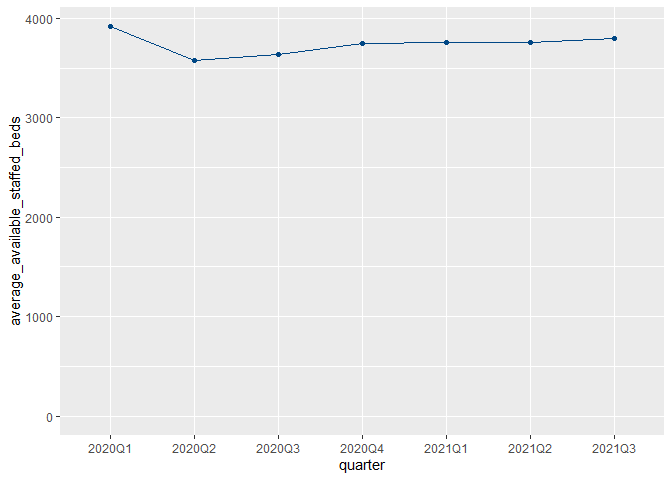<!-- -->

```r
beds %>%
  filter(hb_name == "Scotland") %>%
  ggplot() +
  aes(x = quarter, y = average_occupied_beds, group = hb_name, colour = hb_name) +
  geom_line() +
  geom_point() +
  scale_colour_manual(guide = "none", values = phs_palette[2]) +
  ylim(c(0, NA))
```

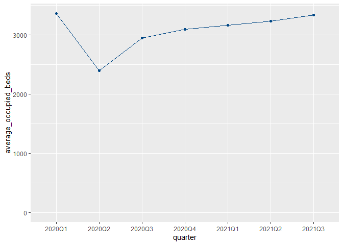<!-- -->

```r
beds %>%
  filter(hb_name == "Scotland") %>%
  ggplot() +
  aes(x = quarter, y = percentage_occupancy, group = hb_name, colour = hb_name) +
  geom_line() +
  geom_point() +
  scale_colour_manual(guide = "none", values = phs_palette[2]) +
  ylim(c(0, NA))
```

<!-- -->

### Sanity check No. 1. 

Check if I pick in the location column the aggregated results of value S08000031 for NHS Greater Glasgow and S08000020 for Grampian

```r
beds %>%
  # filter(hb_name == "NHS Greater Glasgow and Clyde") %>% 
  filter(hb_name == "NHS Grampian") %>% 
  filter(location == hb) %>% 
  summarise(avg_tot_occ_beds = mean(total_occupied_beds),
            avg_avail_staffed_beds = mean(average_available_staffed_beds),
            avg_occupied_beds = mean(average_occupied_beds),
            avg_percentage_occupancy = mean(percentage_occupancy))
```

<div data-pagedtable="false">
  <script data-pagedtable-source type="application/json">
{"columns":[{"label":["avg_tot_occ_beds"],"name":[1],"type":["dbl"],"align":["right"]},{"label":["avg_avail_staffed_beds"],"name":[2],"type":["dbl"],"align":["right"]},{"label":["avg_occupied_beds"],"name":[3],"type":["dbl"],"align":["right"]},{"label":["avg_percentage_occupancy"],"name":[4],"type":["dbl"],"align":["right"]}],"data":[{"1":"70122.29","2":"957.9192","3":"768.2776","4":"80.15914"}],"options":{"columns":{"min":{},"max":[10]},"rows":{"min":[10],"max":[10]},"pages":{}}}
  </script>
</div>


```r
beds %>%
  # filter(hb_name == "NHS Greater Glasgow and Clyde" ) %>% 
  filter(hb_name == "NHS Grampian" ) %>% 
  group_by(location) %>% 
  summarise(avg_tot_occ_beds = mean(total_occupied_beds),
            avg_avail_staffed_beds = mean(average_available_staffed_beds),
            avg_occupied_beds = mean(average_occupied_beds),
            avg_percentage_occupancy = mean(percentage_occupancy)) 
```

<div data-pagedtable="false">
  <script data-pagedtable-source type="application/json">
{"columns":[{"label":["location"],"name":[1],"type":["chr"],"align":["left"]},{"label":["avg_tot_occ_beds"],"name":[2],"type":["dbl"],"align":["right"]},{"label":["avg_avail_staffed_beds"],"name":[3],"type":["dbl"],"align":["right"]},{"label":["avg_occupied_beds"],"name":[4],"type":["dbl"],"align":["right"]},{"label":["avg_percentage_occupancy"],"name":[5],"type":["dbl"],"align":["right"]}],"data":[{"1":"N101H","2":"48766.857","3":"652.2079551","4":"534.3337285","5":"81.76365"},{"1":"N411H","2":"7027.429","3":"98.5499276","4":"76.9952013","5":"78.67589"},{"1":"S08000020","2":"70122.286","3":"957.9191796","4":"768.2776341","5":"80.15914"},{"1":"T312H","2":"58.000","3":"0.6373626","4":"0.6373626","5":"100.00000"}],"options":{"columns":{"min":{},"max":[10]},"rows":{"min":[10],"max":[10]},"pages":{}}}
  </script>
</div>

## Selected Geography: NHS Board

```r
beds %>%
  filter(hb_name == "NHS Greater Glasgow and Clyde") %>%
  filter(location == hb) %>% 
  ggplot() +
  aes(x = quarter, y = total_occupied_beds, group = hb_name, colour = hb_name) +
  geom_line() +
  geom_point() +
  scale_colour_manual(guide = "none", values = phs_palette[2]) +
  ylim(c(0, NA))
```

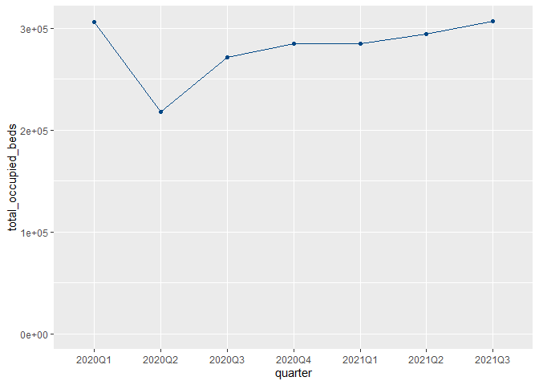<!-- -->

```r
beds %>%
  filter(hb_name == "NHS Greater Glasgow and Clyde") %>%
  filter(location == hb) %>%  
  ggplot() +
  aes(x = quarter, y = average_available_staffed_beds, group = hb_name, colour = hb_name) +
  geom_line() +
  geom_point() +
  scale_colour_manual(guide = "none", values = phs_palette[2]) +
  ylim(c(0, NA))
```

<!-- -->

```r
beds %>%
  filter(hb_name == "NHS Greater Glasgow and Clyde") %>%
  filter(location == hb) %>% 
  ggplot() +
  aes(x = quarter, y = average_occupied_beds, group = hb_name, colour = hb_name) +
  geom_line() +
  geom_point() +
  scale_colour_manual(guide = "none", values = phs_palette[2]) +
  ylim(c(0, NA))
```

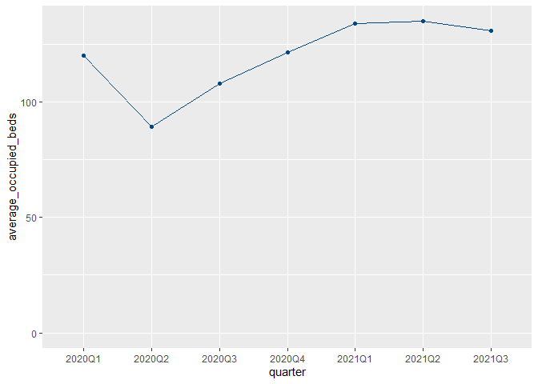<!-- -->

```r
beds %>%
  filter(hb_name == "NHS Greater Glasgow and Clyde") %>%
  filter(location == hb) %>%  
  ggplot() +
  aes(x = quarter, y = percentage_occupancy, group = hb_name, colour = hb_name) +
  geom_line() +
  geom_point() +
  scale_colour_manual(guide = "none", values = phs_palette[2]) +
  ylim(c(0, NA))
```

<!-- -->


### Sanity check No. 2.
Check to see if I pick in the location column the aggregated results of value SB0801 

```r
beds %>%
  # filter(hb_name == "NHS Greater Glasgow and Clyde" ) %>% 
  filter(hb_name == "The Golden Jubilee National Hospital" ) %>% 
  group_by(location) %>% 
  summarise(avg_tot_occ_beds = mean(total_occupied_beds),
            avg_avail_staffed_beds = mean(average_available_staffed_beds),
            avg_occupied_beds = mean(average_occupied_beds),
            avg_percentage_occupancy = mean(percentage_occupancy)) 
```

<div data-pagedtable="false">
  <script data-pagedtable-source type="application/json">
{"columns":[{"label":["location"],"name":[1],"type":["chr"],"align":["left"]},{"label":["avg_tot_occ_beds"],"name":[2],"type":["dbl"],"align":["right"]},{"label":["avg_avail_staffed_beds"],"name":[3],"type":["dbl"],"align":["right"]},{"label":["avg_occupied_beds"],"name":[4],"type":["dbl"],"align":["right"]},{"label":["avg_percentage_occupancy"],"name":[5],"type":["dbl"],"align":["right"]}],"data":[{"1":"D102H","2":"10924.57","3":"172.11","4":"119.6953","5":"69.32331"},{"1":"SB0801","2":"10924.57","3":"172.11","4":"119.6953","5":"69.32331"}],"options":{"columns":{"min":{},"max":[10]},"rows":{"min":[10],"max":[10]},"pages":{}}}
  </script>
</div>


```r
beds %>%
  filter(hb_name == "The Golden Jubilee National Hospital") %>%
  filter(location == hb) %>% 
  summarise(avg_tot_occ_beds = mean(total_occupied_beds),
            avg_avail_staffed_beds = mean(average_available_staffed_beds),
            avg_occupied_beds = mean(average_occupied_beds),
            avg_percentage_occupancy = mean(percentage_occupancy))
```

<div data-pagedtable="false">
  <script data-pagedtable-source type="application/json">
{"columns":[{"label":["avg_tot_occ_beds"],"name":[1],"type":["dbl"],"align":["right"]},{"label":["avg_avail_staffed_beds"],"name":[2],"type":["dbl"],"align":["right"]},{"label":["avg_occupied_beds"],"name":[3],"type":["dbl"],"align":["right"]},{"label":["avg_percentage_occupancy"],"name":[4],"type":["dbl"],"align":["right"]}],"data":[{"1":"10924.57","2":"172.11","3":"119.6953","4":"69.32331"}],"options":{"columns":{"min":{},"max":[10]},"rows":{"min":[10],"max":[10]},"pages":{}}}
  </script>
</div>


## Selected Geography: Special Health Board

```r
beds %>%
  filter(hb_name == "The Golden Jubilee National Hospital") %>%
  filter(location == hb) %>% 
  ggplot() +
  aes(x = quarter, y = total_occupied_beds, group = hb_name, colour = hb_name) +
  geom_line() +
  geom_point() +
  scale_colour_manual(guide = "none", values = phs_palette[2]) +
  ylim(c(0, NA))
```

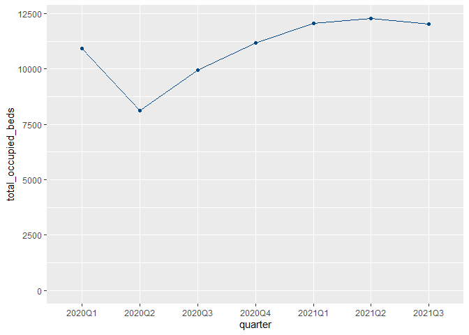<!-- -->

```r
beds %>%
  filter(hb_name == "The Golden Jubilee National Hospital") %>%
  filter(location == hb) %>%  
  ggplot() +
  aes(x = quarter, y = average_available_staffed_beds, group = hb_name, colour = hb_name) +
  geom_line() +
  geom_point() +
  scale_colour_manual(guide = "none", values = phs_palette[2]) +
  ylim(c(0, NA))
```

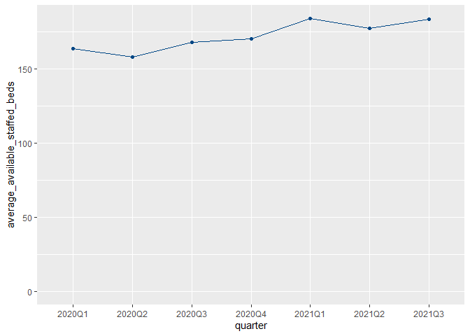<!-- -->

```r
beds %>%
  filter(hb_name == "The Golden Jubilee National Hospital") %>%
  filter(location == hb) %>% 
  ggplot() +
  aes(x = quarter, y = average_occupied_beds, group = hb_name, colour = hb_name) +
  geom_line() +
  geom_point() +
  scale_colour_manual(guide = "none", values = phs_palette[2]) +
  ylim(c(0, NA))
```

<!-- -->

```r
beds %>%
  filter(hb_name == "The Golden Jubilee National Hospital") %>%
  filter(location == hb) %>%  
  ggplot() +
  aes(x = quarter, y = percentage_occupancy, group = hb_name, colour = hb_name) +
  geom_line() +
  geom_point() +
  scale_colour_manual(guide = "none", values = phs_palette[2]) +
  ylim(c(0, NA))
```

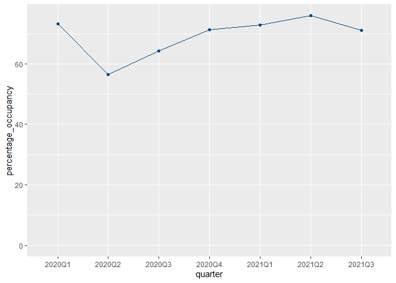<!-- -->


# KPI reference values

Calculate reference bed values (calculated averaged values) from pre-covid data (2016 to 2019) 

## View bed data

```r
beds_oos <- read_csv("data/beds_by_nhs_board_of_treatment_and_specialty.csv") 
```

```
## Rows: 30448 Columns: 20
## -- Column specification --------------------------------------------------------
## Delimiter: ","
## chr (11): Quarter, QuarterQF, HB, HBQF, Location, LocationQF, Specialty, Spe...
## dbl  (5): AllStaffedBeds, TotalOccupiedBeds, AverageAvailableStaffedBeds, Av...
## lgl  (4): AllStaffedBedsQF, TotalOccupiedBedsQF, AverageAvailableStaffedBeds...
## 
## i Use `spec()` to retrieve the full column specification for this data.
## i Specify the column types or set `show_col_types = FALSE` to quiet this message.
```

### Check data  for NA values

```r
quarters_out_of_scope <- c("2016Q3", "2016Q4", "2017Q1", "2017Q2", "2017Q3",
                           "2017Q4", "2018Q1", "2018Q2", "2018Q3", "2018Q4", 
                           "2019Q1", "2019Q2", "2019Q3", "2019Q4")

beds_oos %>%
  filter(Quarter %in% quarters_out_of_scope) %>%
  summarise(across(.cols = everything(),
                   .fns = ~sum(is.na(.x))))
```

<div data-pagedtable="false">
  <script data-pagedtable-source type="application/json">
{"columns":[{"label":["Quarter"],"name":[1],"type":["int"],"align":["right"]},{"label":["QuarterQF"],"name":[2],"type":["int"],"align":["right"]},{"label":["HB"],"name":[3],"type":["int"],"align":["right"]},{"label":["HBQF"],"name":[4],"type":["int"],"align":["right"]},{"label":["Location"],"name":[5],"type":["int"],"align":["right"]},{"label":["LocationQF"],"name":[6],"type":["int"],"align":["right"]},{"label":["Specialty"],"name":[7],"type":["int"],"align":["right"]},{"label":["SpecialtyQF"],"name":[8],"type":["int"],"align":["right"]},{"label":["SpecialtyName"],"name":[9],"type":["int"],"align":["right"]},{"label":["SpecialtyNameQF"],"name":[10],"type":["int"],"align":["right"]},{"label":["AllStaffedBeds"],"name":[11],"type":["int"],"align":["right"]},{"label":["AllStaffedBedsQF"],"name":[12],"type":["int"],"align":["right"]},{"label":["TotalOccupiedBeds"],"name":[13],"type":["int"],"align":["right"]},{"label":["TotalOccupiedBedsQF"],"name":[14],"type":["int"],"align":["right"]},{"label":["AverageAvailableStaffedBeds"],"name":[15],"type":["int"],"align":["right"]},{"label":["AverageAvailableStaffedBedsQF"],"name":[16],"type":["int"],"align":["right"]},{"label":["AverageOccupiedBeds"],"name":[17],"type":["int"],"align":["right"]},{"label":["AverageOccupiedBedsQF"],"name":[18],"type":["int"],"align":["right"]},{"label":["PercentageOccupancy"],"name":[19],"type":["int"],"align":["right"]},{"label":["PercentageOccupancyQF"],"name":[20],"type":["int"],"align":["right"]}],"data":[{"1":"0","2":"20427","3":"0","4":"19570","5":"0","6":"11950","7":"6655","8":"13772","9":"0","10":"14764","11":"0","12":"20427","13":"0","14":"20427","15":"0","16":"20427","17":"0","18":"20427","19":"7","20":"20420"}],"options":{"columns":{"min":{},"max":[10]},"rows":{"min":[10],"max":[10]},"pages":{}}}
  </script>
</div>


### Keep data related to our time frame of interest 

```r
quarters_out_of_scope <- c("2016Q3", "2016Q4", "2017Q1", "2017Q2", "2017Q3",
                           "2017Q4", "2018Q1", "2018Q2", "2018Q3", "2018Q4", 
                           "2019Q1", "2019Q2", "2019Q3", "2019Q4")
```


```r
beds_oos <- beds_oos %>%
  filter(Quarter %in% quarters_out_of_scope)
```


```r
glimpse(beds_oos)
```

```
## Rows: 20,427
## Columns: 20
## $ Quarter                       <chr> "2016Q3", "2016Q3", "2016Q4", "2016Q4", ~
## $ QuarterQF                     <chr> NA, NA, NA, NA, NA, NA, NA, NA, NA, NA, ~
## $ HB                            <chr> "SB0801", "SB0801", "SB0801", "SB0801", ~
## $ HBQF                          <chr> NA, NA, NA, NA, NA, NA, NA, NA, NA, NA, ~
## $ Location                      <chr> "D102H", "SB0801", "D102H", "SB0801", "D~
## $ LocationQF                    <chr> NA, "d", NA, "d", NA, "d", NA, "d", NA, ~
## $ Specialty                     <chr> NA, NA, NA, NA, NA, NA, NA, NA, NA, NA, ~
## $ SpecialtyQF                   <chr> "z", "z", "z", "z", "z", "z", "z", "z", ~
## $ SpecialtyName                 <chr> "All Acute", "All Acute", "All Acute", "~
## $ SpecialtyNameQF               <chr> "d", "d", "d", "d", "d", "d", "d", "d", ~
## $ AllStaffedBeds                <dbl> 16413, 16413, 16117, 16117, 15622, 15622~
## $ AllStaffedBedsQF              <lgl> NA, NA, NA, NA, NA, NA, NA, NA, NA, NA, ~
## $ TotalOccupiedBeds             <dbl> 12380, 12380, 12049, 12049, 11569, 11569~
## $ TotalOccupiedBedsQF           <lgl> NA, NA, NA, NA, NA, NA, NA, NA, NA, NA, ~
## $ AverageAvailableStaffedBeds   <dbl> 178.4022, 178.4022, 175.1848, 175.1848, ~
## $ AverageAvailableStaffedBedsQF <lgl> NA, NA, NA, NA, NA, NA, NA, NA, NA, NA, ~
## $ AverageOccupiedBeds           <dbl> 134.5652, 134.5652, 130.9674, 130.9674, ~
## $ AverageOccupiedBedsQF         <lgl> NA, NA, NA, NA, NA, NA, NA, NA, NA, NA, ~
## $ PercentageOccupancy           <dbl> 75.42801, 75.42801, 74.75957, 74.75957, ~
## $ PercentageOccupancyQF         <chr> NA, NA, NA, NA, NA, NA, NA, NA, NA, NA, ~
```


### How many HB items do we have?

```r
beds_oos %>%
  distinct(HB)
```

<div data-pagedtable="false">
  <script data-pagedtable-source type="application/json">
{"columns":[{"label":["HB"],"name":[1],"type":["chr"],"align":["left"]}],"data":[{"1":"SB0801"},{"1":"S08000015"},{"1":"S08000016"},{"1":"S08000017"},{"1":"S08000029"},{"1":"S08000019"},{"1":"S08000020"},{"1":"S08000031"},{"1":"S08000022"},{"1":"S08000032"},{"1":"S08000024"},{"1":"S08000025"},{"1":"S08000026"},{"1":"S08000030"},{"1":"S08000028"},{"1":"S92000003"}],"options":{"columns":{"min":{},"max":[10]},"rows":{"min":[10],"max":[10]},"pages":{}}}
  </script>
</div>


### Keep SpecialtyName == All Acute for the analysis

```r
beds_oos <- beds_oos %>%
  filter(SpecialtyName == "All Acute")
```


## Join tables 

### Join bed & special health board

```r
beds_oos <- beds_oos %>%
  left_join(shb_labels, by = c("HB" = "SHB"))

glimpse(beds_oos)
```

```
## Rows: 721
## Columns: 21
## $ Quarter                       <chr> "2016Q3", "2016Q3", "2016Q4", "2016Q4", ~
## $ QuarterQF                     <chr> NA, NA, NA, NA, NA, NA, NA, NA, NA, NA, ~
## $ HB                            <chr> "SB0801", "SB0801", "SB0801", "SB0801", ~
## $ HBQF                          <chr> NA, NA, NA, NA, NA, NA, NA, NA, NA, NA, ~
## $ Location                      <chr> "D102H", "SB0801", "D102H", "SB0801", "D~
## $ LocationQF                    <chr> NA, "d", NA, "d", NA, "d", NA, "d", NA, ~
## $ Specialty                     <chr> NA, NA, NA, NA, NA, NA, NA, NA, NA, NA, ~
## $ SpecialtyQF                   <chr> "z", "z", "z", "z", "z", "z", "z", "z", ~
## $ SpecialtyName                 <chr> "All Acute", "All Acute", "All Acute", "~
## $ SpecialtyNameQF               <chr> "d", "d", "d", "d", "d", "d", "d", "d", ~
## $ AllStaffedBeds                <dbl> 16413, 16413, 16117, 16117, 15622, 15622~
## $ AllStaffedBedsQF              <lgl> NA, NA, NA, NA, NA, NA, NA, NA, NA, NA, ~
## $ TotalOccupiedBeds             <dbl> 12380, 12380, 12049, 12049, 11569, 11569~
## $ TotalOccupiedBedsQF           <lgl> NA, NA, NA, NA, NA, NA, NA, NA, NA, NA, ~
## $ AverageAvailableStaffedBeds   <dbl> 178.4022, 178.4022, 175.1848, 175.1848, ~
## $ AverageAvailableStaffedBedsQF <lgl> NA, NA, NA, NA, NA, NA, NA, NA, NA, NA, ~
## $ AverageOccupiedBeds           <dbl> 134.5652, 134.5652, 130.9674, 130.9674, ~
## $ AverageOccupiedBedsQF         <lgl> NA, NA, NA, NA, NA, NA, NA, NA, NA, NA, ~
## $ PercentageOccupancy           <dbl> 75.42801, 75.42801, 74.75957, 74.75957, ~
## $ PercentageOccupancyQF         <chr> NA, NA, NA, NA, NA, NA, NA, NA, NA, NA, ~
## $ SHBName                       <chr> "The Golden Jubilee National Hospital", ~
```


```r
beds_oos %>%
  summarise(across(.cols = everything(),
                   .fns = ~sum(is.na(.x))))
```

<div data-pagedtable="false">
  <script data-pagedtable-source type="application/json">
{"columns":[{"label":["Quarter"],"name":[1],"type":["int"],"align":["right"]},{"label":["QuarterQF"],"name":[2],"type":["int"],"align":["right"]},{"label":["HB"],"name":[3],"type":["int"],"align":["right"]},{"label":["HBQF"],"name":[4],"type":["int"],"align":["right"]},{"label":["Location"],"name":[5],"type":["int"],"align":["right"]},{"label":["LocationQF"],"name":[6],"type":["int"],"align":["right"]},{"label":["Specialty"],"name":[7],"type":["int"],"align":["right"]},{"label":["SpecialtyQF"],"name":[8],"type":["int"],"align":["right"]},{"label":["SpecialtyName"],"name":[9],"type":["int"],"align":["right"]},{"label":["SpecialtyNameQF"],"name":[10],"type":["int"],"align":["right"]},{"label":["AllStaffedBeds"],"name":[11],"type":["int"],"align":["right"]},{"label":["AllStaffedBedsQF"],"name":[12],"type":["int"],"align":["right"]},{"label":["TotalOccupiedBeds"],"name":[13],"type":["int"],"align":["right"]},{"label":["TotalOccupiedBedsQF"],"name":[14],"type":["int"],"align":["right"]},{"label":["AverageAvailableStaffedBeds"],"name":[15],"type":["int"],"align":["right"]},{"label":["AverageAvailableStaffedBedsQF"],"name":[16],"type":["int"],"align":["right"]},{"label":["AverageOccupiedBeds"],"name":[17],"type":["int"],"align":["right"]},{"label":["AverageOccupiedBedsQF"],"name":[18],"type":["int"],"align":["right"]},{"label":["PercentageOccupancy"],"name":[19],"type":["int"],"align":["right"]},{"label":["PercentageOccupancyQF"],"name":[20],"type":["int"],"align":["right"]},{"label":["SHBName"],"name":[21],"type":["int"],"align":["right"]}],"data":[{"1":"0","2":"721","3":"0","4":"707","5":"0","6":"497","7":"721","8":"0","9":"0","10":"0","11":"0","12":"721","13":"0","14":"721","15":"0","16":"721","17":"0","18":"721","19":"0","20":"721","21":"693"}],"options":{"columns":{"min":{},"max":[10]},"rows":{"min":[10],"max":[10]},"pages":{}}}
  </script>
</div>


### Join bed & health board

```r
beds_oos <- beds_oos %>%
  left_join(health_board_labels, "HB")

glimpse(beds_oos)
```

```
## Rows: 721
## Columns: 22
## $ Quarter                       <chr> "2016Q3", "2016Q3", "2016Q4", "2016Q4", ~
## $ QuarterQF                     <chr> NA, NA, NA, NA, NA, NA, NA, NA, NA, NA, ~
## $ HB                            <chr> "SB0801", "SB0801", "SB0801", "SB0801", ~
## $ HBQF                          <chr> NA, NA, NA, NA, NA, NA, NA, NA, NA, NA, ~
## $ Location                      <chr> "D102H", "SB0801", "D102H", "SB0801", "D~
## $ LocationQF                    <chr> NA, "d", NA, "d", NA, "d", NA, "d", NA, ~
## $ Specialty                     <chr> NA, NA, NA, NA, NA, NA, NA, NA, NA, NA, ~
## $ SpecialtyQF                   <chr> "z", "z", "z", "z", "z", "z", "z", "z", ~
## $ SpecialtyName                 <chr> "All Acute", "All Acute", "All Acute", "~
## $ SpecialtyNameQF               <chr> "d", "d", "d", "d", "d", "d", "d", "d", ~
## $ AllStaffedBeds                <dbl> 16413, 16413, 16117, 16117, 15622, 15622~
## $ AllStaffedBedsQF              <lgl> NA, NA, NA, NA, NA, NA, NA, NA, NA, NA, ~
## $ TotalOccupiedBeds             <dbl> 12380, 12380, 12049, 12049, 11569, 11569~
## $ TotalOccupiedBedsQF           <lgl> NA, NA, NA, NA, NA, NA, NA, NA, NA, NA, ~
## $ AverageAvailableStaffedBeds   <dbl> 178.4022, 178.4022, 175.1848, 175.1848, ~
## $ AverageAvailableStaffedBedsQF <lgl> NA, NA, NA, NA, NA, NA, NA, NA, NA, NA, ~
## $ AverageOccupiedBeds           <dbl> 134.5652, 134.5652, 130.9674, 130.9674, ~
## $ AverageOccupiedBedsQF         <lgl> NA, NA, NA, NA, NA, NA, NA, NA, NA, NA, ~
## $ PercentageOccupancy           <dbl> 75.42801, 75.42801, 74.75957, 74.75957, ~
## $ PercentageOccupancyQF         <chr> NA, NA, NA, NA, NA, NA, NA, NA, NA, NA, ~
## $ SHBName                       <chr> "The Golden Jubilee National Hospital", ~
## $ HBName                        <chr> NA, NA, NA, NA, NA, NA, NA, NA, NA, NA, ~
```


```r
beds_oos %>%
  summarise(across(.cols = everything(),
                   .fns = ~sum(is.na(.x))))
```

<div data-pagedtable="false">
  <script data-pagedtable-source type="application/json">
{"columns":[{"label":["Quarter"],"name":[1],"type":["int"],"align":["right"]},{"label":["QuarterQF"],"name":[2],"type":["int"],"align":["right"]},{"label":["HB"],"name":[3],"type":["int"],"align":["right"]},{"label":["HBQF"],"name":[4],"type":["int"],"align":["right"]},{"label":["Location"],"name":[5],"type":["int"],"align":["right"]},{"label":["LocationQF"],"name":[6],"type":["int"],"align":["right"]},{"label":["Specialty"],"name":[7],"type":["int"],"align":["right"]},{"label":["SpecialtyQF"],"name":[8],"type":["int"],"align":["right"]},{"label":["SpecialtyName"],"name":[9],"type":["int"],"align":["right"]},{"label":["SpecialtyNameQF"],"name":[10],"type":["int"],"align":["right"]},{"label":["AllStaffedBeds"],"name":[11],"type":["int"],"align":["right"]},{"label":["AllStaffedBedsQF"],"name":[12],"type":["int"],"align":["right"]},{"label":["TotalOccupiedBeds"],"name":[13],"type":["int"],"align":["right"]},{"label":["TotalOccupiedBedsQF"],"name":[14],"type":["int"],"align":["right"]},{"label":["AverageAvailableStaffedBeds"],"name":[15],"type":["int"],"align":["right"]},{"label":["AverageAvailableStaffedBedsQF"],"name":[16],"type":["int"],"align":["right"]},{"label":["AverageOccupiedBeds"],"name":[17],"type":["int"],"align":["right"]},{"label":["AverageOccupiedBedsQF"],"name":[18],"type":["int"],"align":["right"]},{"label":["PercentageOccupancy"],"name":[19],"type":["int"],"align":["right"]},{"label":["PercentageOccupancyQF"],"name":[20],"type":["int"],"align":["right"]},{"label":["SHBName"],"name":[21],"type":["int"],"align":["right"]},{"label":["HBName"],"name":[22],"type":["int"],"align":["right"]}],"data":[{"1":"0","2":"721","3":"0","4":"707","5":"0","6":"497","7":"721","8":"0","9":"0","10":"0","11":"0","12":"721","13":"0","14":"721","15":"0","16":"721","17":"0","18":"721","19":"0","20":"721","21":"693","22":"42"}],"options":{"columns":{"min":{},"max":[10]},"rows":{"min":[10],"max":[10]},"pages":{}}}
  </script>
</div>


### Join bed & country labels

```r
beds_oos <- beds_oos %>%
  left_join(country_labels, by = c("HB" = "Country"))

glimpse(beds_oos)
```

```
## Rows: 721
## Columns: 23
## $ Quarter                       <chr> "2016Q3", "2016Q3", "2016Q4", "2016Q4", ~
## $ QuarterQF                     <chr> NA, NA, NA, NA, NA, NA, NA, NA, NA, NA, ~
## $ HB                            <chr> "SB0801", "SB0801", "SB0801", "SB0801", ~
## $ HBQF                          <chr> NA, NA, NA, NA, NA, NA, NA, NA, NA, NA, ~
## $ Location                      <chr> "D102H", "SB0801", "D102H", "SB0801", "D~
## $ LocationQF                    <chr> NA, "d", NA, "d", NA, "d", NA, "d", NA, ~
## $ Specialty                     <chr> NA, NA, NA, NA, NA, NA, NA, NA, NA, NA, ~
## $ SpecialtyQF                   <chr> "z", "z", "z", "z", "z", "z", "z", "z", ~
## $ SpecialtyName                 <chr> "All Acute", "All Acute", "All Acute", "~
## $ SpecialtyNameQF               <chr> "d", "d", "d", "d", "d", "d", "d", "d", ~
## $ AllStaffedBeds                <dbl> 16413, 16413, 16117, 16117, 15622, 15622~
## $ AllStaffedBedsQF              <lgl> NA, NA, NA, NA, NA, NA, NA, NA, NA, NA, ~
## $ TotalOccupiedBeds             <dbl> 12380, 12380, 12049, 12049, 11569, 11569~
## $ TotalOccupiedBedsQF           <lgl> NA, NA, NA, NA, NA, NA, NA, NA, NA, NA, ~
## $ AverageAvailableStaffedBeds   <dbl> 178.4022, 178.4022, 175.1848, 175.1848, ~
## $ AverageAvailableStaffedBedsQF <lgl> NA, NA, NA, NA, NA, NA, NA, NA, NA, NA, ~
## $ AverageOccupiedBeds           <dbl> 134.5652, 134.5652, 130.9674, 130.9674, ~
## $ AverageOccupiedBedsQF         <lgl> NA, NA, NA, NA, NA, NA, NA, NA, NA, NA, ~
## $ PercentageOccupancy           <dbl> 75.42801, 75.42801, 74.75957, 74.75957, ~
## $ PercentageOccupancyQF         <chr> NA, NA, NA, NA, NA, NA, NA, NA, NA, NA, ~
## $ SHBName                       <chr> "The Golden Jubilee National Hospital", ~
## $ HBName                        <chr> NA, NA, NA, NA, NA, NA, NA, NA, NA, NA, ~
## $ CountryName                   <chr> NA, NA, NA, NA, NA, NA, NA, NA, NA, NA, ~
```


```r
beds_oos %>%
  # filter(Quarter %in% quarters_in_scope) %>%
  # filter(SpecialtyName == "All Acute") %>% 
  summarise(across(.cols = everything(),
                   .fns = ~sum(is.na(.x))))
```

<div data-pagedtable="false">
  <script data-pagedtable-source type="application/json">
{"columns":[{"label":["Quarter"],"name":[1],"type":["int"],"align":["right"]},{"label":["QuarterQF"],"name":[2],"type":["int"],"align":["right"]},{"label":["HB"],"name":[3],"type":["int"],"align":["right"]},{"label":["HBQF"],"name":[4],"type":["int"],"align":["right"]},{"label":["Location"],"name":[5],"type":["int"],"align":["right"]},{"label":["LocationQF"],"name":[6],"type":["int"],"align":["right"]},{"label":["Specialty"],"name":[7],"type":["int"],"align":["right"]},{"label":["SpecialtyQF"],"name":[8],"type":["int"],"align":["right"]},{"label":["SpecialtyName"],"name":[9],"type":["int"],"align":["right"]},{"label":["SpecialtyNameQF"],"name":[10],"type":["int"],"align":["right"]},{"label":["AllStaffedBeds"],"name":[11],"type":["int"],"align":["right"]},{"label":["AllStaffedBedsQF"],"name":[12],"type":["int"],"align":["right"]},{"label":["TotalOccupiedBeds"],"name":[13],"type":["int"],"align":["right"]},{"label":["TotalOccupiedBedsQF"],"name":[14],"type":["int"],"align":["right"]},{"label":["AverageAvailableStaffedBeds"],"name":[15],"type":["int"],"align":["right"]},{"label":["AverageAvailableStaffedBedsQF"],"name":[16],"type":["int"],"align":["right"]},{"label":["AverageOccupiedBeds"],"name":[17],"type":["int"],"align":["right"]},{"label":["AverageOccupiedBedsQF"],"name":[18],"type":["int"],"align":["right"]},{"label":["PercentageOccupancy"],"name":[19],"type":["int"],"align":["right"]},{"label":["PercentageOccupancyQF"],"name":[20],"type":["int"],"align":["right"]},{"label":["SHBName"],"name":[21],"type":["int"],"align":["right"]},{"label":["HBName"],"name":[22],"type":["int"],"align":["right"]},{"label":["CountryName"],"name":[23],"type":["int"],"align":["right"]}],"data":[{"1":"0","2":"721","3":"0","4":"707","5":"0","6":"497","7":"721","8":"0","9":"0","10":"0","11":"0","12":"721","13":"0","14":"721","15":"0","16":"721","17":"0","18":"721","19":"0","20":"721","21":"693","22":"42","23":"707"}],"options":{"columns":{"min":{},"max":[10]},"rows":{"min":[10],"max":[10]},"pages":{}}}
  </script>
</div>


### Concatenate ``SHBName``, ``HBName`` and ``CountryName`` in a single column called ``HBName``

```r
beds_oos <- beds_oos %>%
  mutate(HBName = if_else(!is.na(HBName), HBName, SHBName)) %>%
  mutate(HBName = if_else(!is.na(HBName), HBName, CountryName)) %>%
  select(-SHBName, -CountryName)

glimpse(beds_oos)
```

```
## Rows: 721
## Columns: 21
## $ Quarter                       <chr> "2016Q3", "2016Q3", "2016Q4", "2016Q4", ~
## $ QuarterQF                     <chr> NA, NA, NA, NA, NA, NA, NA, NA, NA, NA, ~
## $ HB                            <chr> "SB0801", "SB0801", "SB0801", "SB0801", ~
## $ HBQF                          <chr> NA, NA, NA, NA, NA, NA, NA, NA, NA, NA, ~
## $ Location                      <chr> "D102H", "SB0801", "D102H", "SB0801", "D~
## $ LocationQF                    <chr> NA, "d", NA, "d", NA, "d", NA, "d", NA, ~
## $ Specialty                     <chr> NA, NA, NA, NA, NA, NA, NA, NA, NA, NA, ~
## $ SpecialtyQF                   <chr> "z", "z", "z", "z", "z", "z", "z", "z", ~
## $ SpecialtyName                 <chr> "All Acute", "All Acute", "All Acute", "~
## $ SpecialtyNameQF               <chr> "d", "d", "d", "d", "d", "d", "d", "d", ~
## $ AllStaffedBeds                <dbl> 16413, 16413, 16117, 16117, 15622, 15622~
## $ AllStaffedBedsQF              <lgl> NA, NA, NA, NA, NA, NA, NA, NA, NA, NA, ~
## $ TotalOccupiedBeds             <dbl> 12380, 12380, 12049, 12049, 11569, 11569~
## $ TotalOccupiedBedsQF           <lgl> NA, NA, NA, NA, NA, NA, NA, NA, NA, NA, ~
## $ AverageAvailableStaffedBeds   <dbl> 178.4022, 178.4022, 175.1848, 175.1848, ~
## $ AverageAvailableStaffedBedsQF <lgl> NA, NA, NA, NA, NA, NA, NA, NA, NA, NA, ~
## $ AverageOccupiedBeds           <dbl> 134.5652, 134.5652, 130.9674, 130.9674, ~
## $ AverageOccupiedBedsQF         <lgl> NA, NA, NA, NA, NA, NA, NA, NA, NA, NA, ~
## $ PercentageOccupancy           <dbl> 75.42801, 75.42801, 74.75957, 74.75957, ~
## $ PercentageOccupancyQF         <chr> NA, NA, NA, NA, NA, NA, NA, NA, NA, NA, ~
## $ HBName                        <chr> "The Golden Jubilee National Hospital", ~
```


###  Tidy up finalised bed table

```r
beds_oos <- beds_oos %>%
  clean_names()

glimpse(beds_oos)
```

```
## Rows: 721
## Columns: 21
## $ quarter                           <chr> "2016Q3", "2016Q3", "2016Q4", "2016Q~
## $ quarter_qf                        <chr> NA, NA, NA, NA, NA, NA, NA, NA, NA, ~
## $ hb                                <chr> "SB0801", "SB0801", "SB0801", "SB080~
## $ hbqf                              <chr> NA, NA, NA, NA, NA, NA, NA, NA, NA, ~
## $ location                          <chr> "D102H", "SB0801", "D102H", "SB0801"~
## $ location_qf                       <chr> NA, "d", NA, "d", NA, "d", NA, "d", ~
## $ specialty                         <chr> NA, NA, NA, NA, NA, NA, NA, NA, NA, ~
## $ specialty_qf                      <chr> "z", "z", "z", "z", "z", "z", "z", "~
## $ specialty_name                    <chr> "All Acute", "All Acute", "All Acute~
## $ specialty_name_qf                 <chr> "d", "d", "d", "d", "d", "d", "d", "~
## $ all_staffed_beds                  <dbl> 16413, 16413, 16117, 16117, 15622, 1~
## $ all_staffed_beds_qf               <lgl> NA, NA, NA, NA, NA, NA, NA, NA, NA, ~
## $ total_occupied_beds               <dbl> 12380, 12380, 12049, 12049, 11569, 1~
## $ total_occupied_beds_qf            <lgl> NA, NA, NA, NA, NA, NA, NA, NA, NA, ~
## $ average_available_staffed_beds    <dbl> 178.4022, 178.4022, 175.1848, 175.18~
## $ average_available_staffed_beds_qf <lgl> NA, NA, NA, NA, NA, NA, NA, NA, NA, ~
## $ average_occupied_beds             <dbl> 134.5652, 134.5652, 130.9674, 130.96~
## $ average_occupied_beds_qf          <lgl> NA, NA, NA, NA, NA, NA, NA, NA, NA, ~
## $ percentage_occupancy              <dbl> 75.42801, 75.42801, 74.75957, 74.759~
## $ percentage_occupancy_qf           <chr> NA, NA, NA, NA, NA, NA, NA, NA, NA, ~
## $ hb_name                           <chr> "The Golden Jubilee National Hospita~
```

**Sanity Check - There should be on average 13,270 available staffed beds in Scotland during quarter ending December 2019 (PHS report)**

```r
beds_oos %>%
  # filter(hb_name == "NHS Borders")
  filter(hb_name == "Scotland")
```

<div data-pagedtable="false">
  <script data-pagedtable-source type="application/json">
{"columns":[{"label":["quarter"],"name":[1],"type":["chr"],"align":["left"]},{"label":["quarter_qf"],"name":[2],"type":["chr"],"align":["left"]},{"label":["hb"],"name":[3],"type":["chr"],"align":["left"]},{"label":["hbqf"],"name":[4],"type":["chr"],"align":["left"]},{"label":["location"],"name":[5],"type":["chr"],"align":["left"]},{"label":["location_qf"],"name":[6],"type":["chr"],"align":["left"]},{"label":["specialty"],"name":[7],"type":["chr"],"align":["left"]},{"label":["specialty_qf"],"name":[8],"type":["chr"],"align":["left"]},{"label":["specialty_name"],"name":[9],"type":["chr"],"align":["left"]},{"label":["specialty_name_qf"],"name":[10],"type":["chr"],"align":["left"]},{"label":["all_staffed_beds"],"name":[11],"type":["dbl"],"align":["right"]},{"label":["all_staffed_beds_qf"],"name":[12],"type":["lgl"],"align":["right"]},{"label":["total_occupied_beds"],"name":[13],"type":["dbl"],"align":["right"]},{"label":["total_occupied_beds_qf"],"name":[14],"type":["lgl"],"align":["right"]},{"label":["average_available_staffed_beds"],"name":[15],"type":["dbl"],"align":["right"]},{"label":["average_available_staffed_beds_qf"],"name":[16],"type":["lgl"],"align":["right"]},{"label":["average_occupied_beds"],"name":[17],"type":["dbl"],"align":["right"]},{"label":["average_occupied_beds_qf"],"name":[18],"type":["lgl"],"align":["right"]},{"label":["percentage_occupancy"],"name":[19],"type":["dbl"],"align":["right"]},{"label":["percentage_occupancy_qf"],"name":[20],"type":["chr"],"align":["left"]},{"label":["hb_name"],"name":[21],"type":["chr"],"align":["left"]}],"data":[{"1":"2016Q3","2":"NA","3":"S92000003","4":"d","5":"S92000003","6":"d","7":"NA","8":"z","9":"All Acute","10":"d","11":"1245969","12":"NA","13":"1060632","14":"NA","15":"13543.14","16":"NA","17":"11528.61","18":"NA","19":"85.12507","20":"NA","21":"Scotland"},{"1":"2016Q4","2":"NA","3":"S92000003","4":"d","5":"S92000003","6":"d","7":"NA","8":"z","9":"All Acute","10":"d","11":"1248572","12":"NA","13":"1067482","14":"NA","15":"13571.43","16":"NA","17":"11603.07","18":"NA","19":"85.49623","20":"NA","21":"Scotland"},{"1":"2017Q1","2":"NA","3":"S92000003","4":"d","5":"S92000003","6":"d","7":"NA","8":"z","9":"All Acute","10":"d","11":"1237090","12":"NA","13":"1074566","14":"NA","15":"13745.44","16":"NA","17":"11939.62","18":"NA","19":"86.86239","20":"NA","21":"Scotland"},{"1":"2017Q2","2":"NA","3":"S92000003","4":"d","5":"S92000003","6":"d","7":"NA","8":"z","9":"All Acute","10":"d","11":"1228359","12":"NA","13":"1051647","14":"NA","15":"13498.45","16":"NA","17":"11556.56","18":"NA","19":"85.61398","20":"NA","21":"Scotland"},{"1":"2017Q3","2":"NA","3":"S92000003","4":"d","5":"S92000003","6":"d","7":"NA","8":"z","9":"All Acute","10":"d","11":"1220454","12":"NA","13":"1038083","14":"NA","15":"13265.80","16":"NA","17":"11283.51","18":"NA","19":"85.05712","20":"NA","21":"Scotland"},{"1":"2017Q4","2":"NA","3":"S92000003","4":"d","5":"S92000003","6":"d","7":"NA","8":"z","9":"All Acute","10":"d","11":"1228781","12":"NA","13":"1068296","14":"NA","15":"13356.32","16":"NA","17":"11611.91","18":"NA","19":"86.93950","20":"NA","21":"Scotland"},{"1":"2018Q1","2":"NA","3":"S92000003","4":"d","5":"S92000003","6":"d","7":"NA","8":"z","9":"All Acute","10":"d","11":"1223841","12":"NA","13":"1093330","14":"NA","15":"13598.23","16":"NA","17":"12148.11","18":"NA","19":"89.33595","20":"NA","21":"Scotland"},{"1":"2018Q2","2":"NA","3":"S92000003","4":"d","5":"S92000003","6":"d","7":"NA","8":"z","9":"All Acute","10":"d","11":"1202640","12":"NA","13":"1041847","14":"NA","15":"13215.82","16":"NA","17":"11448.87","18":"NA","19":"86.63000","20":"NA","21":"Scotland"},{"1":"2018Q3","2":"NA","3":"S92000003","4":"d","5":"S92000003","6":"d","7":"NA","8":"z","9":"All Acute","10":"d","11":"1186814","12":"NA","13":"1025383","14":"NA","15":"12900.15","16":"NA","17":"11145.47","18":"NA","19":"86.39795","20":"NA","21":"Scotland"},{"1":"2018Q4","2":"NA","3":"S92000003","4":"d","5":"S92000003","6":"d","7":"NA","8":"z","9":"All Acute","10":"d","11":"1194788","12":"NA","13":"1035108","14":"NA","15":"12986.83","16":"NA","17":"11251.17","18":"NA","19":"86.63529","20":"NA","21":"Scotland"},{"1":"2019Q1","2":"NA","3":"S92000003","4":"d","5":"S92000003","6":"d","7":"NA","8":"z","9":"All Acute","10":"d","11":"1189794","12":"NA","13":"1058672","14":"NA","15":"13219.93","16":"NA","17":"11763.02","18":"NA","19":"88.97944","20":"NA","21":"Scotland"},{"1":"2019Q2","2":"NA","3":"S92000003","4":"d","5":"S92000003","6":"d","7":"NA","8":"z","9":"All Acute","10":"d","11":"1189109","12":"NA","13":"1035618","14":"NA","15":"13067.13","16":"NA","17":"11380.42","18":"NA","19":"87.09193","20":"NA","21":"Scotland"},{"1":"2019Q3","2":"NA","3":"S92000003","4":"d","5":"S92000003","6":"d","7":"NA","8":"z","9":"All Acute","10":"d","11":"1205360","12":"NA","13":"1032773","14":"NA","15":"13101.74","16":"NA","17":"11225.79","18":"NA","19":"85.68171","20":"NA","21":"Scotland"},{"1":"2019Q4","2":"NA","3":"S92000003","4":"d","5":"S92000003","6":"d","7":"NA","8":"z","9":"All Acute","10":"d","11":"1220823","12":"NA","13":"1062601","14":"NA","15":"13269.82","16":"NA","17":"11550.01","18":"NA","19":"87.03973","20":"NA","21":"Scotland"}],"options":{"columns":{"min":{},"max":[10]},"rows":{"min":[10],"max":[10]},"pages":{}}}
  </script>
</div>

## KPI plots (Scotland: 2016Q3 - 2019Q4)


### Selected Geography: Scotland

```r
beds_oos %>%
  filter(hb_name == "Scotland") %>% 
  ggplot() +
  aes(x = quarter, y = total_occupied_beds, group = hb_name, colour = hb_name) +
  geom_line() +
  geom_point() +
  scale_colour_manual(guide = "none", values = phs_palette[2]) +
  ylim(c(0, NA)) +
  theme(axis.text.x = element_text(angle = 30, vjust = +1, hjust = 1))
```

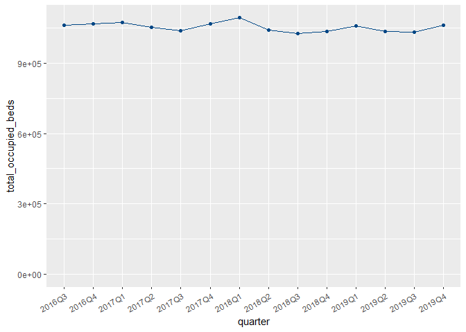<!-- -->

```r
beds_oos %>%
  filter(hb_name == "Scotland") %>%
  ggplot() +
  aes(x = quarter, y = average_available_staffed_beds, group = hb_name, colour = hb_name) +
  geom_line() +
  geom_point() +
  scale_colour_manual(guide = "none", values = phs_palette[2]) +
  ylim(c(0, NA)) +
  theme(axis.text.x = element_text(angle = 30, vjust = +1, hjust = 1))
```

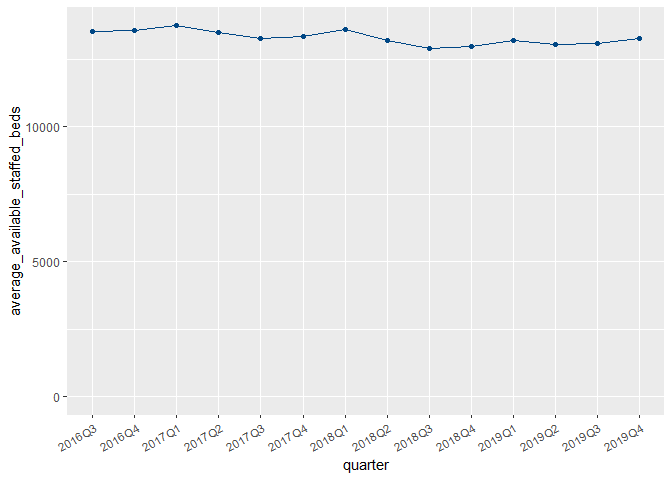<!-- -->

```r
beds_oos %>%
  filter(hb_name == "Scotland") %>%
  ggplot() +
  aes(x = quarter, y = average_occupied_beds, group = hb_name, colour = hb_name) +
  geom_line() +
  geom_point() +
  scale_colour_manual(guide = "none", values = phs_palette[2]) +
  ylim(c(0, NA)) +
  theme(axis.text.x = element_text(angle = 30, vjust = +1, hjust = 1))
```

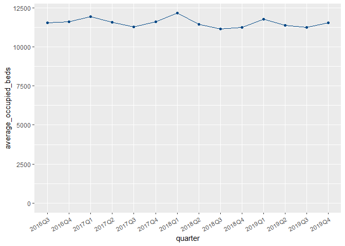<!-- -->

```r
beds_oos %>%
  filter(hb_name == "Scotland") %>%
  ggplot() +
  aes(x = quarter, y = percentage_occupancy, group = hb_name, colour = hb_name) +
  geom_line() +
  geom_point() +
  scale_colour_manual(guide = "none", values = phs_palette[2]) +
  ylim(c(0, NA)) +
  theme(axis.text.x = element_text(angle = 30, vjust = +1, hjust = 1))
```

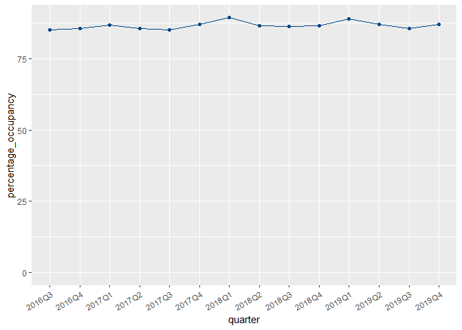<!-- -->


### Sanity check No. 1. 

Check if I pick the aggregated results of value S08000031 for NHS Greater Glasgow and S08000020 for Grampian in the location column

```r
beds_oos %>%
  # filter(hb_name == "NHS Greater Glasgow and Clyde") %>% 
  filter(hb_name == "NHS Grampian") %>% 
  filter(location == hb) %>% 
  summarise(avg_tot_occ_beds = mean(total_occupied_beds),
            avg_avail_staffed_beds = mean(average_available_staffed_beds),
            avg_occupied_beds = mean(average_occupied_beds),
            avg_percentage_occupancy = mean(percentage_occupancy))
```

<div data-pagedtable="false">
  <script data-pagedtable-source type="application/json">
{"columns":[{"label":["avg_tot_occ_beds"],"name":[1],"type":["dbl"],"align":["right"]},{"label":["avg_avail_staffed_beds"],"name":[2],"type":["dbl"],"align":["right"]},{"label":["avg_occupied_beds"],"name":[3],"type":["dbl"],"align":["right"]},{"label":["avg_percentage_occupancy"],"name":[4],"type":["dbl"],"align":["right"]}],"data":[{"1":"82787.57","2":"1072.285","3":"906.364","4":"84.51053"}],"options":{"columns":{"min":{},"max":[10]},"rows":{"min":[10],"max":[10]},"pages":{}}}
  </script>
</div>


```r
beds_oos %>%
  # filter(hb_name == "NHS Greater Glasgow and Clyde" ) %>% 
  filter(hb_name == "NHS Grampian" ) %>% 
  group_by(location) %>% 
  summarise(avg_tot_occ_beds = mean(total_occupied_beds),
            avg_avail_staffed_beds = mean(average_available_staffed_beds),
            avg_occupied_beds = mean(average_occupied_beds),
            avg_percentage_occupancy = mean(percentage_occupancy)) 
```

<div data-pagedtable="false">
  <script data-pagedtable-source type="application/json">
{"columns":[{"label":["location"],"name":[1],"type":["chr"],"align":["left"]},{"label":["avg_tot_occ_beds"],"name":[2],"type":["dbl"],"align":["right"]},{"label":["avg_avail_staffed_beds"],"name":[3],"type":["dbl"],"align":["right"]},{"label":["avg_occupied_beds"],"name":[4],"type":["dbl"],"align":["right"]},{"label":["avg_percentage_occupancy"],"name":[5],"type":["dbl"],"align":["right"]}],"data":[{"1":"N101H","2":"55378.21429","3":"693.8153243","4":"606.2831750","5":"87.37897"},{"1":"N411H","2":"8878.21429","3":"116.9316444","4":"97.2059012","5":"83.04257"},{"1":"S08000020","2":"82787.57143","3":"1072.2852086","4":"906.3640102","5":"84.51053"},{"1":"T312H","2":"84.33333","3":"0.9194139","4":"0.9194139","5":"100.00000"}],"options":{"columns":{"min":{},"max":[10]},"rows":{"min":[10],"max":[10]},"pages":{}}}
  </script>
</div>


### Selected Geography: NHS Board

```r
beds_oos %>%
  filter(hb_name == "NHS Ayrshire and Arran") %>%
  filter(location == hb) %>% 
  ggplot() +
  aes(x = quarter, y = total_occupied_beds, group = hb_name, colour = hb_name) +
  geom_line() +
  geom_point() +
  scale_colour_manual(guide = "none", values = phs_palette[2]) +
  ylim(c(0, NA)) +
  theme(axis.text.x = element_text(angle = 30, vjust = +1, hjust = 1))
```

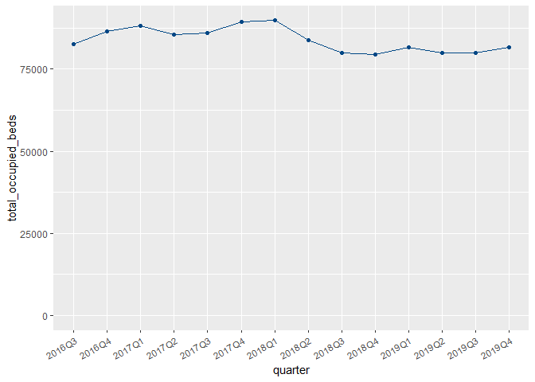<!-- -->

```r
beds_oos %>%
  filter(hb_name == "NHS Ayrshire and Arran") %>%
  filter(location == hb) %>%  
  ggplot() +
  aes(x = quarter, y = average_available_staffed_beds, group = hb_name, colour = hb_name) +
  geom_line() +
  geom_point() +
  scale_colour_manual(guide = "none", values = phs_palette[2]) +
  ylim(c(0, NA)) +
  theme(axis.text.x = element_text(angle = 30, vjust = +1, hjust = 1))
```

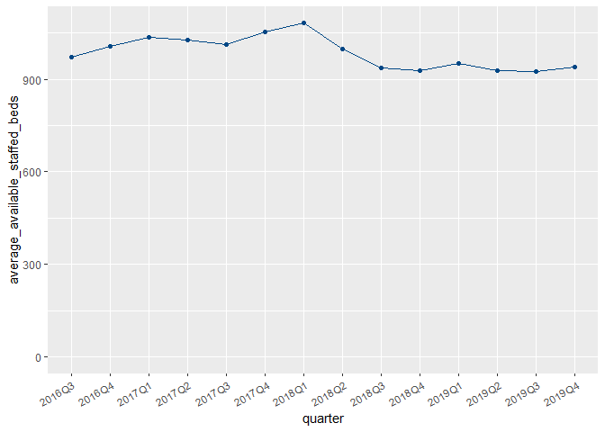<!-- -->

```r
beds_oos %>%
  filter(hb_name == "NHS Ayrshire and Arran") %>%
  filter(location == hb) %>% 
  ggplot() +
  aes(x = quarter, y = average_occupied_beds, group = hb_name, colour = hb_name) +
  geom_line() +
  geom_point() +
  scale_colour_manual(guide = "none", values = phs_palette[2]) +
  ylim(c(0, NA)) +
  theme(axis.text.x = element_text(angle = 30, vjust = +1, hjust = 1))
```

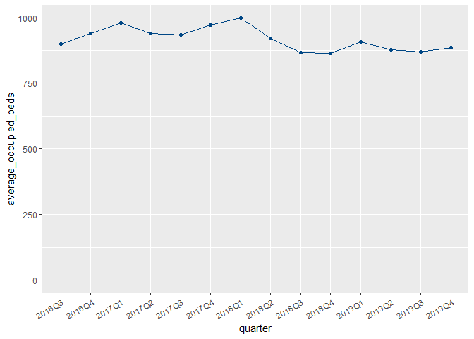<!-- -->

```r
beds_oos %>%
  filter(hb_name == "NHS Ayrshire and Arran") %>%
  filter(location == hb) %>%  
  ggplot() +
  aes(x = quarter, y = percentage_occupancy, group = hb_name, colour = hb_name) +
  geom_line() +
  geom_point() +
  scale_colour_manual(guide = "none", values = phs_palette[2]) +
  ylim(c(0, NA)) +
  theme(axis.text.x = element_text(angle = 30, vjust = +1, hjust = 1))
```

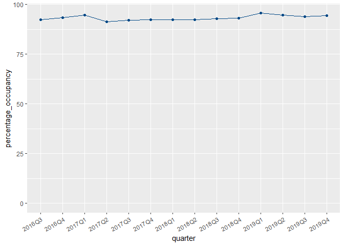<!-- -->


### Sanity check No. 2.
Check to see if I pick the aggregated results of value SB0801 in the location column

```r
beds_oos %>%
  # filter(hb_name == "NHS Greater Glasgow and Clyde" ) %>% 
  filter(hb_name == "The Golden Jubilee National Hospital" ) %>% 
  group_by(location) %>% 
  summarise(avg_tot_occ_beds = mean(total_occupied_beds),
            avg_avail_staffed_beds = mean(average_available_staffed_beds),
            avg_occupied_beds = mean(average_occupied_beds),
            avg_percentage_occupancy = mean(percentage_occupancy)) 
```

<div data-pagedtable="false">
  <script data-pagedtable-source type="application/json">
{"columns":[{"label":["location"],"name":[1],"type":["chr"],"align":["left"]},{"label":["avg_tot_occ_beds"],"name":[2],"type":["dbl"],"align":["right"]},{"label":["avg_avail_staffed_beds"],"name":[3],"type":["dbl"],"align":["right"]},{"label":["avg_occupied_beds"],"name":[4],"type":["dbl"],"align":["right"]},{"label":["avg_percentage_occupancy"],"name":[5],"type":["dbl"],"align":["right"]}],"data":[{"1":"D102H","2":"11954","3":"170.6036","4":"130.8462","5":"76.72998"},{"1":"SB0801","2":"11954","3":"170.6036","4":"130.8462","5":"76.72998"}],"options":{"columns":{"min":{},"max":[10]},"rows":{"min":[10],"max":[10]},"pages":{}}}
  </script>
</div>


```r
beds_oos %>%
  filter(hb_name == "The Golden Jubilee National Hospital") %>%
  filter(location == hb) %>% 
  summarise(avg_tot_occ_beds = mean(total_occupied_beds),
            avg_avail_staffed_beds = mean(average_available_staffed_beds),
            avg_occupied_beds = mean(average_occupied_beds),
            avg_percentage_occupancy = mean(percentage_occupancy))
```

<div data-pagedtable="false">
  <script data-pagedtable-source type="application/json">
{"columns":[{"label":["avg_tot_occ_beds"],"name":[1],"type":["dbl"],"align":["right"]},{"label":["avg_avail_staffed_beds"],"name":[2],"type":["dbl"],"align":["right"]},{"label":["avg_occupied_beds"],"name":[3],"type":["dbl"],"align":["right"]},{"label":["avg_percentage_occupancy"],"name":[4],"type":["dbl"],"align":["right"]}],"data":[{"1":"11954","2":"170.6036","3":"130.8462","4":"76.72998"}],"options":{"columns":{"min":{},"max":[10]},"rows":{"min":[10],"max":[10]},"pages":{}}}
  </script>
</div>


### Selected Geography: Special Health Board

```r
beds_oos %>%
  filter(hb_name == "The Golden Jubilee National Hospital") %>%
  filter(location == hb) %>% 
  ggplot() +
  aes(x = quarter, y = total_occupied_beds, group = hb_name, colour = hb_name) +
  geom_line() +
  geom_point() +
  scale_colour_manual(guide = "none", values = phs_palette[2]) +
  ylim(c(0, NA)) +
  theme(axis.text.x = element_text(angle = 30, vjust = +1, hjust = 1))
```

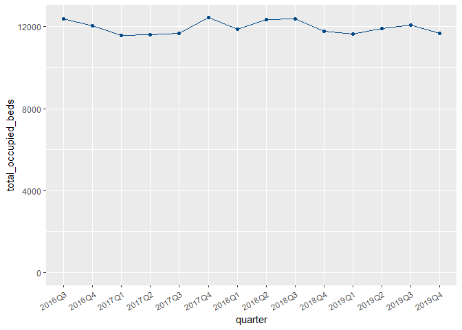<!-- -->

```r
beds_oos %>%
  filter(hb_name == "The Golden Jubilee National Hospital") %>%
  filter(location == hb) %>%  
  ggplot() +
  aes(x = quarter, y = average_available_staffed_beds, group = hb_name, colour = hb_name) +
  geom_line() +
  geom_point() +
  scale_colour_manual(guide = "none", values = phs_palette[2]) +
  ylim(c(0, NA)) +
  theme(axis.text.x = element_text(angle = 30, vjust = +1, hjust = 1))
```

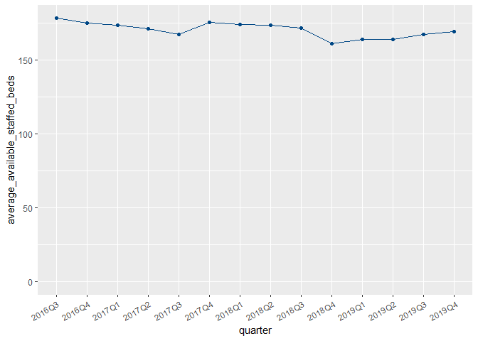<!-- -->

```r
beds_oos %>%
  filter(hb_name == "The Golden Jubilee National Hospital") %>%
  filter(location == hb) %>% 
  ggplot() +
  aes(x = quarter, y = average_occupied_beds, group = hb_name, colour = hb_name) +
  geom_line() +
  geom_point() +
  scale_colour_manual(guide = "none", values = phs_palette[2]) +
  ylim(c(0, NA)) +
  theme(axis.text.x = element_text(angle = 30, vjust = +1, hjust = 1))
```

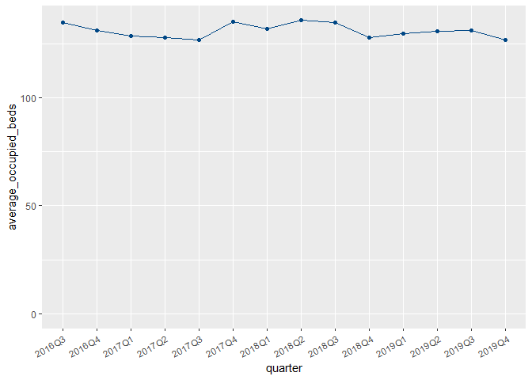<!-- -->

```r
beds_oos %>%
  filter(hb_name == "The Golden Jubilee National Hospital") %>%
  filter(location == hb) %>%  
  ggplot() +
  aes(x = quarter, y = percentage_occupancy, group = hb_name, colour = hb_name) +
  geom_line() +
  geom_point() +
  scale_colour_manual(guide = "none", values = phs_palette[2]) +
  ylim(c(0, NA)) +
  theme(axis.text.x = element_text(angle = 30, vjust = +1, hjust = 1))
```

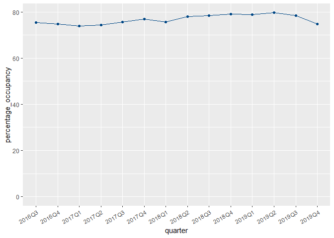<!-- -->

## Calculate mean values


```r
kpi_mean_stats <- beds_oos %>% 
  group_by(hb) %>%
  # group_by(hb, hb_name) %>%
  filter(location == hb) %>% 
  summarise(
    # location_count = n(),
    mean_tob = mean(total_occupied_beds),
    mean_aasb = mean(average_available_staffed_beds), 
    mean_aob = mean(average_occupied_beds), 
    mean_po = mean(percentage_occupancy)
  )
```


# Join bed tibble with KPI stats tibble

```r
beds <- beds %>%
  left_join(kpi_mean_stats, "hb")

glimpse(beds)
```

```
## Rows: 361
## Columns: 25
## $ quarter                           <chr> "2020Q1", "2020Q1", "2020Q2", "2020Q~
## $ quarter_qf                        <chr> NA, NA, NA, NA, NA, NA, NA, NA, NA, ~
## $ hb                                <chr> "SB0801", "SB0801", "SB0801", "SB080~
## $ hbqf                              <chr> NA, NA, NA, NA, NA, NA, NA, NA, NA, ~
## $ location                          <chr> "D102H", "SB0801", "D102H", "SB0801"~
## $ location_qf                       <chr> NA, "d", NA, "d", NA, "d", NA, "d", ~
## $ specialty                         <chr> NA, NA, NA, NA, NA, NA, NA, NA, NA, ~
## $ specialty_qf                      <chr> "z", "z", "z", "z", "z", "z", "z", "~
## $ specialty_name                    <chr> "All Acute", "All Acute", "All Acute~
## $ specialty_name_qf                 <chr> "d", "d", "d", "d", "d", "d", "d", "~
## $ all_staffed_beds                  <dbl> 14896, 14896, 14366, 14366, 15442, 1~
## $ all_staffed_beds_qf               <lgl> NA, NA, NA, NA, NA, NA, NA, NA, NA, ~
## $ total_occupied_beds               <dbl> 10915, 10915, 8101, 8101, 9934, 9934~
## $ total_occupied_beds_qf            <lgl> NA, NA, NA, NA, NA, NA, NA, NA, NA, ~
## $ average_available_staffed_beds    <dbl> 163.6923, 163.6923, 157.8681, 157.86~
## $ average_available_staffed_beds_qf <lgl> NA, NA, NA, NA, NA, NA, NA, NA, NA, ~
## $ average_occupied_beds             <dbl> 119.94505, 119.94505, 89.02198, 89.0~
## $ average_occupied_beds_qf          <lgl> NA, NA, NA, NA, NA, NA, NA, NA, NA, ~
## $ percentage_occupancy              <dbl> 73.27470, 73.27470, 56.39009, 56.390~
## $ percentage_occupancy_qf           <chr> NA, NA, NA, NA, NA, NA, NA, NA, NA, ~
## $ hb_name                           <chr> "The Golden Jubilee National Hospita~
## $ mean_tob                          <dbl> 11954.00, 11954.00, 11954.00, 11954.~
## $ mean_aasb                         <dbl> 170.6036, 170.6036, 170.6036, 170.60~
## $ mean_aob                          <dbl> 130.8462, 130.8462, 130.8462, 130.84~
## $ mean_po                           <dbl> 76.72998, 76.72998, 76.72998, 76.729~
```

# Save cleaned data

Write updated bed data to a CSV file.

```r
 write_csv(beds, here("beds_clean.csv"))
```


# KPI plots with stats (Scotland: 2020Q1 - 2021Q3)


## Selected Geography: Scotland

```r
beds %>%
  filter(hb_name == "Scotland") %>% 
  ggplot() +
  aes(x = quarter, group = hb_name) +
  geom_line(aes(y = total_occupied_beds, colour = hb_name)) +
  geom_point(aes(y = total_occupied_beds, colour = hb_name)) +
  geom_line(aes(y = mean_tob), colour = "red") +
  scale_colour_manual(guide = "none", values = phs_palette[2]) +
  ylim(c(0, NA))
```

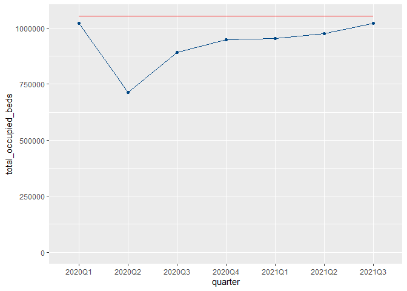<!-- -->

```r
beds %>%
  filter(hb_name == "Scotland") %>% 
  ggplot() +
  aes(x = quarter, group = hb_name) +
  geom_line(aes(y = average_available_staffed_beds, colour = hb_name)) +
  geom_point(aes(y = average_available_staffed_beds, colour = hb_name)) +
  geom_line(aes(y = mean_aasb), colour = "red") +
  scale_colour_manual(guide = "none", values = phs_palette[2]) +
  ylim(c(0, NA))
```

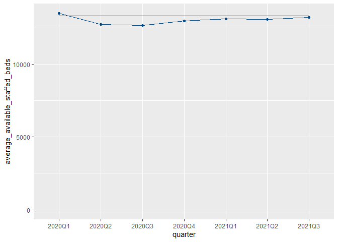<!-- -->

```r
beds %>%
  filter(hb_name == "Scotland") %>% 
  ggplot() +
  aes(x = quarter, group = hb_name) +
  geom_line(aes(y = average_occupied_beds, colour = hb_name)) +
  geom_point(aes(y = average_occupied_beds, colour = hb_name)) +
  geom_line(aes(y = mean_aob), colour = "red") +
  scale_colour_manual(guide = "none", values = phs_palette[2]) +
  ylim(c(0, NA))
```

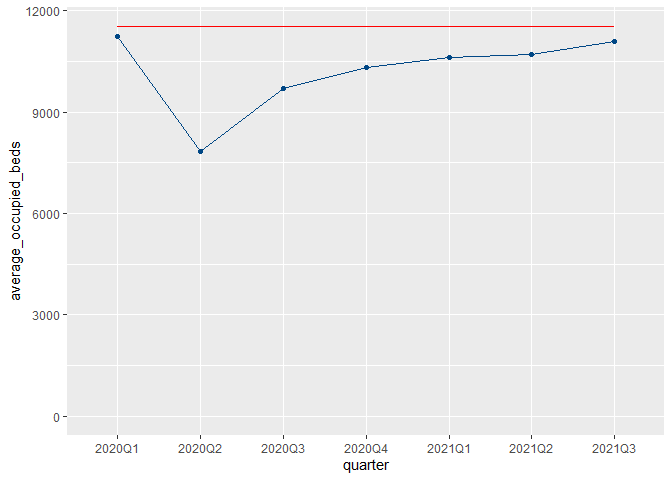<!-- -->

```r
beds %>%
  filter(hb_name == "Scotland") %>% 
  filter(location == hb) %>%  
  ggplot() +
  aes(x = quarter, group = hb_name) +
  geom_line(aes(y = percentage_occupancy, colour = hb_name)) +
  geom_point(aes(y = percentage_occupancy, colour = hb_name)) +
  geom_line(aes(y = mean_po), colour = "red") +
  scale_colour_manual(guide = "none", values = phs_palette[2]) +
  ylim(c(0, NA))
```

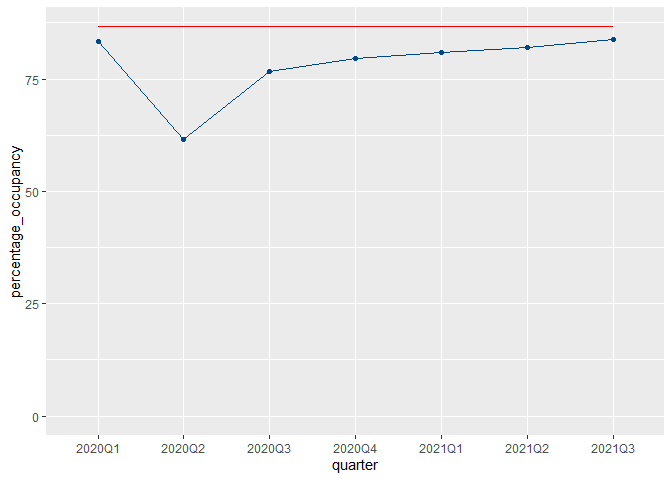<!-- -->


## Selected Geography: NHS Board

```r
beds %>%
  filter(hb_name == "NHS Greater Glasgow and Clyde") %>% 
  filter(location == hb) %>%  
  ggplot() +
  aes(x = quarter, group = hb_name) +
  geom_line(aes(y = total_occupied_beds, colour = hb_name)) +
  geom_point(aes(y = total_occupied_beds, colour = hb_name)) +
  geom_line(aes(y = mean_tob), colour = "red") +
  scale_colour_manual(guide = "none", values = phs_palette[2]) +
  ylim(c(0, NA))
```

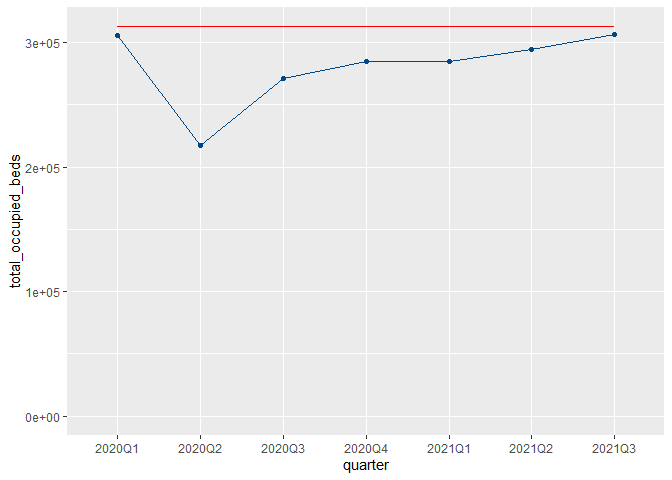<!-- -->

```r
beds %>%
  filter(hb_name == "NHS Greater Glasgow and Clyde") %>% 
  filter(location == hb) %>%  
  ggplot() +
  aes(x = quarter, group = hb_name) +
  geom_line(aes(y = average_available_staffed_beds, colour = hb_name)) +
  geom_point(aes(y = average_available_staffed_beds, colour = hb_name)) +
  geom_line(aes(y = mean_aasb), colour = "red") +
  scale_colour_manual(guide = "none", values = phs_palette[2]) +
  ylim(c(0, NA))
```

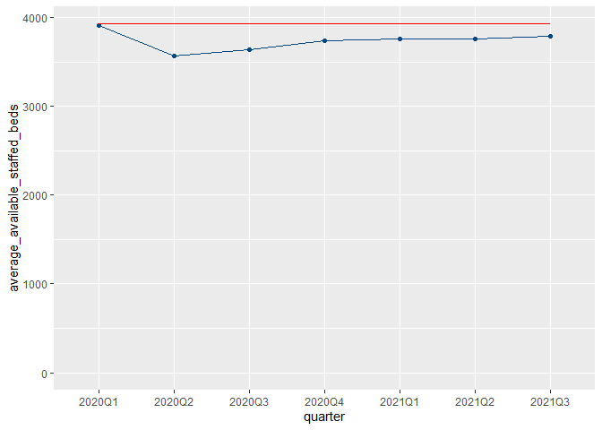<!-- -->

```r
beds %>%
  filter(hb_name == "NHS Greater Glasgow and Clyde") %>% 
  filter(location == hb) %>%  
  ggplot() +
  aes(x = quarter, group = hb_name) +
  geom_line(aes(y = average_occupied_beds, colour = hb_name)) +
  geom_point(aes(y = average_occupied_beds, colour = hb_name)) +
  geom_line(aes(y = mean_aob), colour = "red") +
  scale_colour_manual(guide = "none", values = phs_palette[2]) +
  ylim(c(0, NA))
```

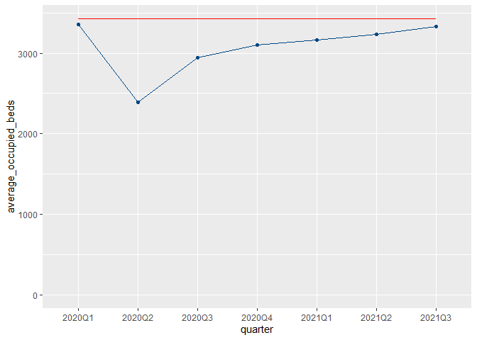<!-- -->

```r
beds %>%
  filter(hb_name == "NHS Greater Glasgow and Clyde") %>% 
  filter(location == hb) %>%  
  ggplot() +
  aes(x = quarter, group = hb_name) +
  geom_line(aes(y = percentage_occupancy, colour = hb_name)) +
  geom_point(aes(y = percentage_occupancy, colour = hb_name)) +
  geom_line(aes(y = mean_po), colour = "red") +
  scale_colour_manual(guide = "none", values = phs_palette[2]) +
  ylim(c(0, NA))
```

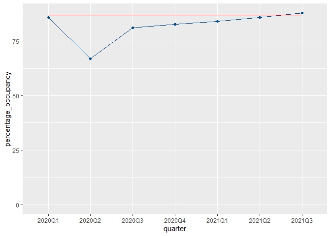<!-- -->


## Selected Geography: Special Health Board

```r
beds %>%
  filter(hb_name == "The Golden Jubilee National Hospital") %>% 
  filter(location == hb) %>%  
  ggplot() +
  aes(x = quarter, group = hb_name) +
  geom_line(aes(y = total_occupied_beds, colour = hb_name)) +
  geom_point(aes(y = total_occupied_beds, colour = hb_name)) +
  geom_line(aes(y = mean_tob), colour = "red") +
  scale_colour_manual(guide = "none", values = phs_palette[2]) +
  ylim(c(0, NA))
```

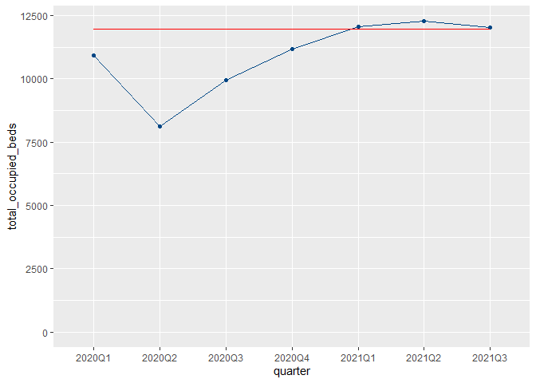<!-- -->

```r
beds %>%
  filter(hb_name == "The Golden Jubilee National Hospital") %>% 
  filter(location == hb) %>%  
  ggplot() +
  aes(x = quarter, group = hb_name) +
  geom_line(aes(y = average_available_staffed_beds, colour = hb_name)) +
  geom_point(aes(y = average_available_staffed_beds, colour = hb_name)) +
  geom_line(aes(y = mean_aasb), colour = "red") +
  scale_colour_manual(guide = "none", values = phs_palette[2]) +
  ylim(c(0, NA))
```

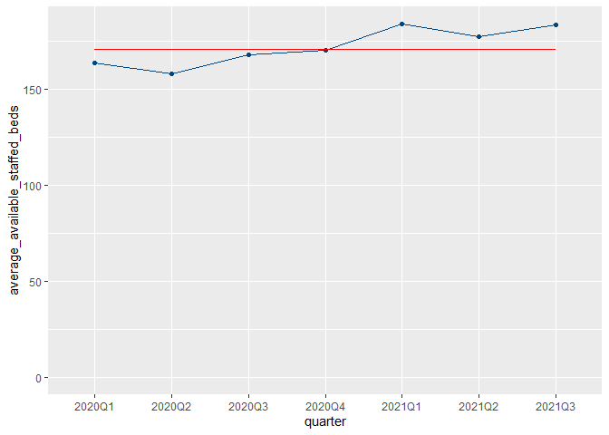<!-- -->

```r
beds %>%
  filter(hb_name == "The Golden Jubilee National Hospital") %>% 
  filter(location == hb) %>%  
  ggplot() +
  aes(x = quarter, group = hb_name) +
  geom_line(aes(y = average_occupied_beds, colour = hb_name)) +
  geom_point(aes(y = average_occupied_beds, colour = hb_name)) +
  geom_line(aes(y = mean_aob), colour = "red") +
  scale_colour_manual(guide = "none", values = phs_palette[2]) +
  ylim(c(0, NA))
```

<!-- -->

```r
beds %>%
  filter(hb_name == "The Golden Jubilee National Hospital") %>% 
  filter(location == hb) %>%  
  ggplot() +
  aes(x = quarter, group = hb_name) +
  geom_line(aes(y = percentage_occupancy, colour = hb_name)) +
  geom_point(aes(y = percentage_occupancy, colour = hb_name)) +
  geom_line(aes(y = mean_po), colour = "red") +
  scale_colour_manual(guide = "none", values = phs_palette[2]) +
  ylim(c(0, NA))
```

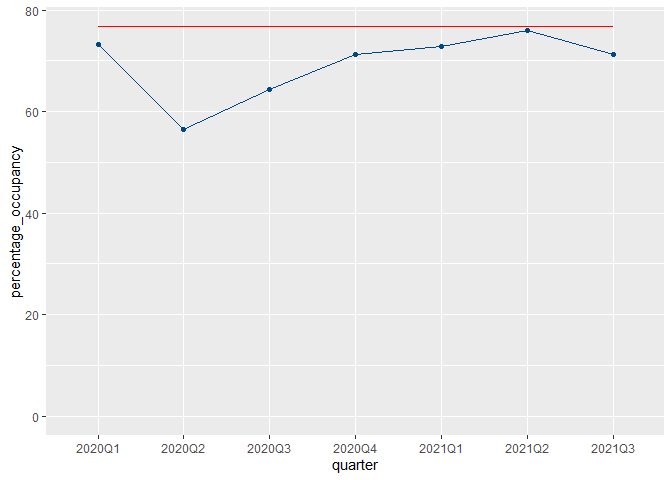<!-- -->


# Doodles

<!-- ```{r} -->
<!-- country_name_beds <- unique(beds$country_name) %>%  -->
<!--   discard(is.na) -->

<!-- ``` -->

<!-- ```{r} -->
<!-- hb_name_beds <- unique(beds$hb_name) %>%  -->
<!--   discard(is.na) -->

<!-- ``` -->


<!-- ```{r} -->
<!-- shb_name_beds <- unique(beds$shb_name) %>%  -->
<!--   discard(is.na) -->

<!-- ``` -->
